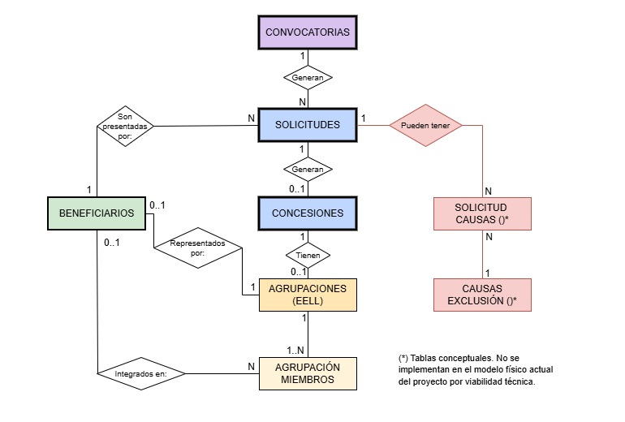
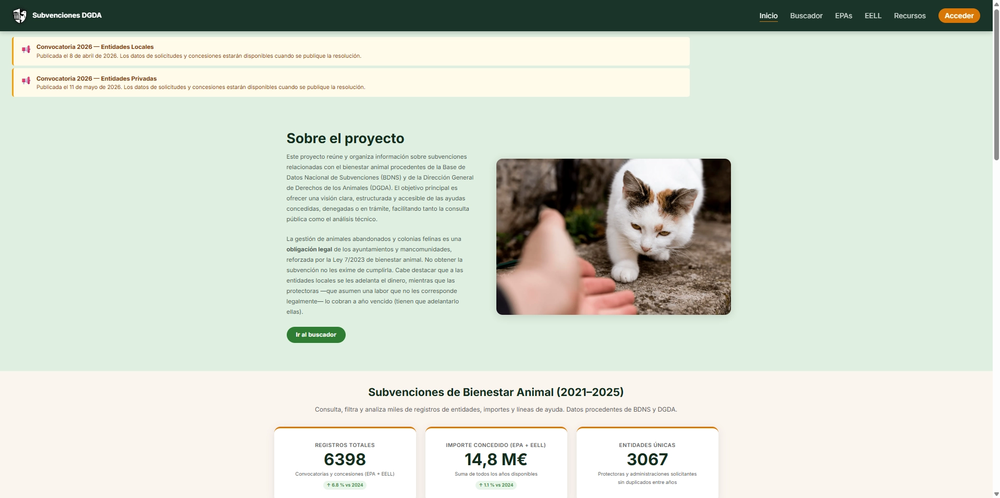
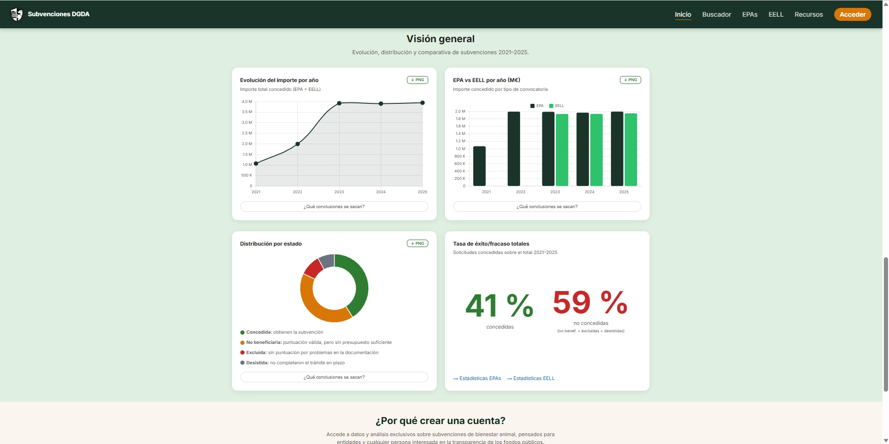
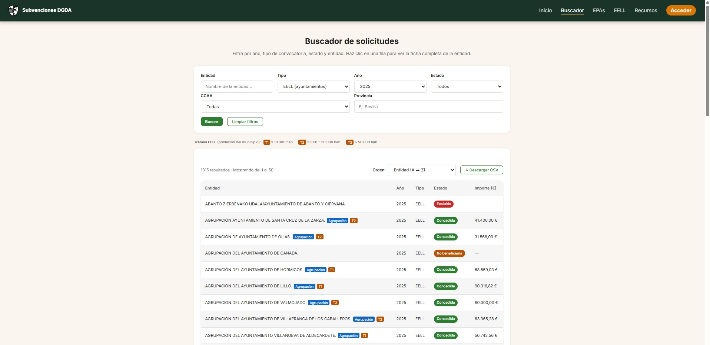
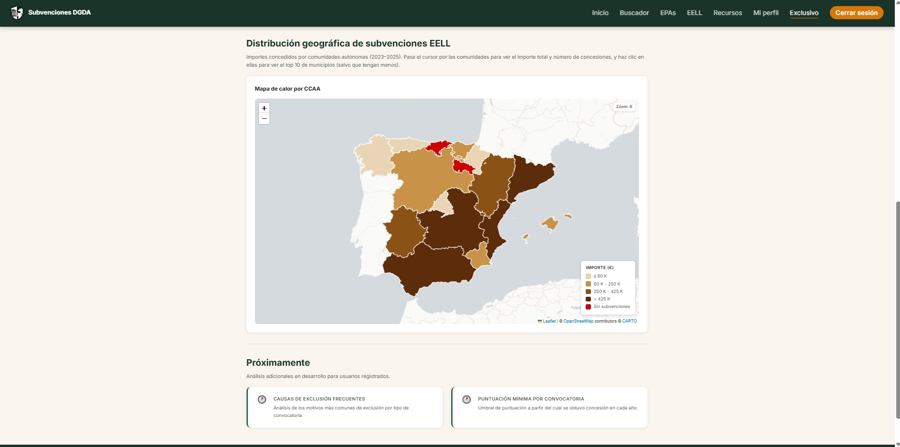

# Análisis de subvenciones de bienestar animal (BDNS + DGDA)

Proyecto independiente y sin ánimo de lucro de recopilación y análisis de subvenciones de bienestar animal en España (BDNS + DGDA). La idea venía de antes, pero tomó forma como proyecto intermodular de **2º FPGS Desarrollo de Aplicaciones Web (DAW)**; desde entonces se ha seguido mejorando y ampliando más allá del ámbito académico.

---

## Autora

Proyecto desarrollado por:

- [Verónica Corpa](https://github.com/vcv-code)

---

## Índice

- **Proyecto**
  - [Objetivos del proyecto](#objetivos-del-proyecto)
  - [Tecnologías](#tecnologías)
  - [Estructura del proyecto](#estructura-del-proyecto)
  - [Documentación técnica](#documentación-técnica)
  - [Arquitectura del sistema](#arquitectura-del-sistema)
- **Datos**
  - [Fuentes de datos analizadas](#fuentes-de-datos-analizadas)
  - [Fuentes oficiales DGDA (BOE)](#fuentes-oficiales-dgda-boe)
  - [Pipeline de datos](#pipeline-de-datos)
  - [Scripts de datos](#scripts-de-datos)
  - [Validación de datos](#validación-de-datos)
  - [Dataset final](#dataset-final)
- **Aplicación**
  - [Descripción general del proyecto](#descripción-general-del-proyecto)
    - [Base de datos](#base-de-datos)
    - [Backend](#backend)
    - [Frontend](#frontend)
      - [Capturas](#capturas)
      - [Compatibilidad de navegadores](#compatibilidad-de-navegadores)
- **Instalación y uso**
  - [Instalación](#instalación)
  - [Dependencias](#dependencias)
  - [Docker — arrancar el sistema](#docker--arrancar-el-sistema)
    - [Nginx — qué hace exactamente](#nginx--qué-hace-exactamente)
    - [Tamaño de las imágenes Docker](#tamaño-de-las-imágenes-docker)
  - [Makefile — atajos para el día a día](#makefile--atajos-para-el-día-a-día)
  - [Tests](#tests)
    - [Automáticos (pytest)](#ejecutar-todos-los-tests)
    - [Manuales — integración E2E](#pruebas-de-integración-end-to-end-manuales)
- **Proceso y estado**
  - [Flujo de trabajo](#flujo-de-trabajo)
  - [Gestión del proyecto](#gestión-del-proyecto)
  - [Estado actual](#estado-actual)
  - [Buenas prácticas aplicadas](#buenas-prácticas-aplicadas)
- **Apéndices**
  - [Notas técnicas](#notas-técnicas)
  - [Limitaciones conocidas del dato de origen](#limitaciones-conocidas-del-dato-de-origen)
  - [Despliegue en producción](#despliegue-en-producción)
  - [Mejoras futuras](#mejoras-futuras)

---

## Objetivos del proyecto

El proyecto consiste en el desarrollo de una **plataforma web para analizar subvenciones públicas relacionadas con bienestar animal en España**, centralizando información actualmente dispersa y permitiendo su consulta, filtrado y visualización a partir de datos abiertos y documentos oficiales.

El sistema permite:

- centralizar información de subvenciones públicas  
- consultar convocatorias y beneficiarios  
- aplicar filtros por año, territorio y tipo de beneficiario  
- mostrar resultados en tablas  
- generar gráficos de análisis  
- ofrecer información útil a entidades que quieran solicitar subvenciones  

El proyecto busca facilitar el análisis y comprensión de las políticas públicas de bienestar animal a partir de datos abiertos.

---

## Documentación técnica

La documentación está repartida en tres sitios según a quién sirve: `docs/` para la referencia técnica, `frontend/docs/` para lo específico de la interfaz y `manuales/` para los procedimientos paso a paso.

- [Referencia técnica](docs/referencia-tecnica.md) — arquitectura, seguridad, HTTPS, cron, logs, tests y comandos
- [Pipeline de datos](docs/pipeline-datos.md) — API BDNS, parsers, herramientas, problemas resueltos y organización del dataset
- [Modelo de datos](docs/modelo-datos.md) — esquema de la BD y relaciones
- [Sistema de autenticación](docs/autenticacion.md) — JWT, access/refresh token, rotación, verificación de email, alta de usuarios sin registro público
- [Tests automáticos](docs/tests.md) — cobertura y técnicas
- [Especificaciones del frontend](frontend/docs/especificaciones-frontend.md) — componentes, páginas y decisiones de diseño
- [Diseño del frontend](frontend/docs/diseño.md) — paleta, tipografía y guía visual
- [Patrones JavaScript](frontend/docs/patrones.md) — URLSearchParams, history, fetch, auth cliente, delegación de eventos
- [Auditoría del frontend](frontend/docs/auditoria-frontend.md) — lista de verificación de calidad: estructura, accesibilidad, rendimiento y limpieza de CSS/JS
- [Manual de instalación](manuales/manual-instalacion.md) — poner el proyecto en marcha en tu propio equipo
- [Manual de despliegue](manuales/manual-despliegue.md) — sacarlo a un servidor: asegurar la máquina, DNS, Docker, Let's Encrypt y los errores que salieron
- [Historial de implementación](docs/historial-implementacion.md) — registro completo de funcionalidades desarrolladas

---

## Arquitectura del sistema

El sistema sigue una arquitectura cliente–servidor basada en una API REST. Todos los servicios corren en contenedores Docker orquestados con `docker compose`.

```text
API externa BDNS + PDFs/XML BOE
          ↓  (scripts de parseo, se ejecutan una vez)
    Base de datos MariaDB
          ↓
    Backend FastAPI  ←──── Cron (sincronización automática con BDNS)
          ↓
    Nginx (puerto 443 HTTPS)
     ├── /solicitudes, /estadisticas, /auth…  → proxy al backend (8000 interno)
     └── el resto                             → archivos estáticos del frontend
          ↓
    Navegador (HTML + CSS + JS vanilla)
```

**Flujo de una petición típica:**

1. El navegador carga `buscador.html` desde Nginx (archivo estático)
2. El JS hace `fetch('/solicitudes/?tipo=epa&...')` al mismo dominio
3. Nginx redirige la petición al backend FastAPI
4. FastAPI consulta MariaDB y devuelve JSON
5. El JS pinta los resultados en la tabla

**Cron:** contenedor independiente que cada pocos días comprueba la API de BDNS para detectar nuevas convocatorias y actualizar la `fecha_resolucion` de las convocatorias pendientes cuando BDNS la publica (hace desaparecer el aviso de la home automáticamente). El contenido de las resoluciones —beneficiarios e importes— no se descarga automáticamente: requiere ejecutar los parsers del BOE manualmente.

---

## Tecnologías

| Área | Tecnologías |
|-----|-------------|
| Frontend | HTML, CSS y JavaScript sin framework · Chart.js (gráficas) · Leaflet (mapa por CCAA) |
| Backend | Python, FastAPI, SQLAlchemy, JWT (python-jose), bcrypt, PyMySQL |
| Base de datos | MariaDB 11.8 |
| Tests | pytest, SQLite en memoria |
| Infraestructura | Docker, Nginx, scheduler Python (cron en contenedor), Mailpit (SMTP dev) |
| Producción | VPS Ubuntu 24.04, Let's Encrypt (certbot), ufw, fail2ban, copias de seguridad programadas |
| Control de versiones | Git, GitHub |
| Herramientas de desarrollo | Makefile, VS Code (extensions.json incluido) |
| Fuentes de datos | API BDNS, XML BOE, PDFs oficiales (DGDA) |

---

## Estructura del proyecto

```text
analisis-bdns-dgda/
├── .gitignore              ← archivos excluidos del repositorio (venv, .env, SSL, backups, datos raw…)
├── .vscode/extensions.json ← extensiones recomendadas del editor
├── LICENSE                 ← código All Rights Reserved; contenido CC BY-NC-ND 4.0
├── install.sh              ← instalación automática
├── uninstall.sh            ← desinstalación guiada
├── Makefile                ← atajos de desarrollo
├── pytest.ini              ← configuración de pytest
├── requeriments.txt        ← dependencias Python para scripts locales (parsers, carga de datos)
│
├── backend/
│   ├── app/
│   │   ├── routers/        ← endpoints FastAPI
│   │   ├── models.py       ← ORM SQLAlchemy
│   │   ├── schemas.py      ← validación Pydantic
│   │   └── auth.py         ← JWT y funciones de autenticación
│   └── requirements.txt    ← dependencias del contenedor Docker (FastAPI, SQLAlchemy…)
│
├── frontend/
│   ├── css/styles.css      ← hoja de estilos compartida
│   ├── js/                 ← un archivo JS por página
│   ├── assets/             ← imágenes, logos, wireframes
│   ├── docs/               ← especificaciones y diseño frontend
│   └── *.html              ← páginas de la aplicación
│
├── docker/
│   ├── docker-compose.yml  ← define los 6 servicios, red interna y volúmenes
│   ├── nginx/default.conf  ← proxy inverso + HTTPS + rate limiting
│   ├── nginx-tls/          ← rutas del certificado (lo único que cambia en producción)
│   ├── cron/               ← scheduler Python
│   └── init/               ← SQL inicial y migraciones
│
├── data/
│   ├── raw/                ← XMLs y PDFs del BOE descargados
│   ├── processed/          ← JSONs intermedios por año
│   └── final/dataset_unificado.json
│
├── scripts/
│   ├── data_processing/    ← parsers EPA y EELL, carga de BD
│   ├── ingestion/          ← cliente API BDNS
│   ├── migraciones/        ← SQL para actualizar una BD que ya tiene datos (ver docs/migraciones.md)
│   ├── revisar_duplicados.py ← auditoría de entidades: duplicados, CIF y provincias
│   ├── crear_admin.sh      ← alta de la cuenta de administración
│   └── backup_db.sh        ← volcado de la BD con rotación
│
├── logs/                   ← salida de nginx, backend y cron (ignorada por git salvo .gitkeep)
│
├── manuales/               ← manual de instalación y manual de despliegue
│
├── docs/                   ← referencia técnica, modelo datos, tests
│   └── img/                ← diagramas ER y capturas de pantalla (README)
└── tests/                  ← tests automáticos (pytest)
```

---

## Fuentes de datos analizadas

### API BDNS

<https://www.infosubvenciones.es/bdnstrans/doc>

Endpoints:

- `/convocatorias/busqueda`  
- `/concesiones/busqueda`  

---

### Líneas analizadas

- **Protectoras (EPA)** → desde 2021  
- **Entidades locales (EELL)** → desde 2023  

---

### Limitación detectada

De las ocho convocatorias resueltas de la DGDA, **la API pública solo publica las concesiones de una**: la de 2022, comunicadas el 14 de febrero de 2023. Las demás no están, ni en el registro general ni en los de *de minimis* o ayudas de Estado. Y aun ese único año trae solo las concedidas: sin puntuaciones y sin causas de exclusión, que son el 59 % del dataset.

Esto obliga a usar los documentos oficiales del BOE (XML y PDF) como fuente principal.

No es un hueco de la norma: la Ley 38/2003 (arts. 18.2 y 20.2) obliga a comunicar también las resoluciones de concesión, con beneficiarios e importes. El detalle de la comprobación, con la tabla convocatoria a convocatoria, está en [docs/pipeline-datos.md](docs/pipeline-datos.md).

---

## Fuentes oficiales DGDA (BOE)

Salvo las de 2022, las resoluciones de concesión no están en la API BDNS — se obtienen directamente de los documentos oficiales publicados en el BOE.

### Datos de protectoras (EPA) — XML BOE

| Campo | Descripción |
|-------|-------------|
| CIF | Identificador fiscal de la entidad |
| Expediente | Número de expediente de la solicitud |
| Entidad | Nombre de la protectora |
| Puntuación | Puntuación obtenida en la evaluación |
| Importe | Importe concedido (€) |
| Estado | Concedida / No beneficiaria / Excluida / Desistida |
| Línea | Línea de subvención: colonias felinas / animales abandonados (EPA 2024 y 2025; la de 2024 se obtiene de la relación de admitidas, ver Pipeline de datos) |

### Datos de ayuntamientos (EELL) — PDF (2023–2024) y XML+Excel (2025)

| Campo | Descripción |
|-------|-------------|
| NIF / CIF | Identificador fiscal del ayuntamiento |
| Expediente | Número de expediente |
| Entidad | Nombre del ayuntamiento o mancomunidad |
| Puntuación | Puntuación obtenida |
| Importe | Importe concedido (€) |
| Estado | Concedida / No beneficiaria / Excluida / Desistida |
| Tramo | Tramo poblacional (T1/T2/T3) — solo EELL 2025 |

**Agrupaciones municipales:** varios ayuntamientos pueden presentarse conjuntamente. En ese caso el importe aparece a nombre del representante, pero en EELL 2025 el Excel complementario incluye el desglose individual por municipio miembro (`agrupacion_miembros`), con el importe asignado a cada uno.

---

## Pipeline de datos

La API BDNS proporciona las convocatorias, pero de los beneficiarios reales solo publica los de 2022 y sin puntuaciones ni exclusiones. Los datos de concesiones se obtienen de documentos oficiales del BOE (XML, PDF, Excel) y se procesan mediante un pipeline de parseo, normalización y carga:

```text
XML / PDF / Excel BOE (DGDA)
      ↓  pdfplumber · BeautifulSoup · openpyxl
JSON por año (data/processed/)
      ↓  unificar_datasets.py
data/final/dataset_unificado.json
      ↓  normalizar_causa_exclusion.py   (códigos de causa canónicos ";")
data/final/dataset_unificado.json
      ↓  cargar_dataset.py
MariaDB — 7 pasos: convocatorias → beneficiarios → solicitudes
          → concesiones → agrupaciones → agrupacion_miembros
          → causas_exclusion (catálogo código→motivo)
```

> **Los pasos no son opcionales ni intercambiables.** Dos detalles que muerden si se salta alguno:
>
> - `unificar_datasets.py` reescribe el dataset con las causas de exclusión **tal cual vienen del BOE** (`10, 12, 16`). Ejecutarlo suelto revierte la normalización de ~370 registros a su forma cruda. Usa **`make dataset`**, que encadena la unificación y la normalización en el orden correcto.
> - `cargar_dataset.py` es **aditivo**: inserta lo que falta y salta lo que ya existe por `(num_expediente, id_convoc)`; nunca actualiza ni borra. Sirve para poblar una BD vacía o añadir una convocatoria nueva. Si cambian registros ya cargados, `make cargar` **no** los actualiza — hay que recrear la BD con **`make reset-db`**.

Fuentes por tipo:

- **EPA** (protectoras) — XML BOE · 2021–2025 · parser base + parser 2025 separado por cambio de cabeceras
- **EELL** (ayuntamientos) — PDF 2023–2024 + XML y Excel 2025 (las tablas de beneficiarias se publicaron como imágenes en el BOE; se transcribieron manualmente a `eell_2025_beneficiarias.xlsx`)

Los principales problemas técnicos resueltos (parsers inconsistentes entre años, duplicados cross-year, derivación de provincia/CCAA desde CIF, periodo semestral EPA 2023–2024) están documentados en detalle en [docs/pipeline-datos.md](docs/pipeline-datos.md).

---

## Scripts de datos

Los scripts transforman los datos crudos (XMLs, PDFs, Excel del BOE) en el dataset unificado que después se carga en la base de datos. El pipeline completo se describe en [docs/pipeline-datos.md](docs/pipeline-datos.md).

### BDNS

`scripts/ingestion/bdns_client.py` — consulta la API pública de BDNS para obtener convocatorias y comprobar si se ha publicado la fecha de resolución de convocatorias pendientes.

`scripts/data_processing/bdns_lookup.py` — lee los snapshots descargados por `bdns_client.py` y proporciona `num_convoc`, `fecha_convocatoria` y `titulo_convoc` oficiales al paso de carga de convocatorias (`cargar_dataset.py`). Si BDNS no tiene una convocatoria concreta, los diccionarios `_FECHAS` y `_TITULO` de `cargar_dataset.py` actúan como fallback.

### Extracción de datos

`scripts/data_extractor/` — descarga los documentos del BOE (XML y PDF) con los datos de concesiones.

### Procesamiento

`scripts/migraciones/` — SQL que lleva una base de datos **que ya tiene datos** de una versión a la siguiente. Hacen falta porque `modelo-fisico.sql` solo se ejecuta con el directorio de datos vacío: en un servidor desplegado, una columna nueva no aparece sola, y `cargar_dataset` es aditivo y no reescribe filas existentes. `docs/migraciones.md` explica cómo saber si el próximo despliegue necesita una, cómo escribirla y cómo ensayarla contra una réplica del servidor.

`scripts/data_processing/` — parsers para cada tipo de fuente (EPA XML, EELL PDF/Excel), normalización de estados, unificación del dataset, normalización de las causas de exclusión a códigos canónicos (`normalizar_causa_exclusion.py`, guiada por el catálogo `data/final/causas_exclusion.json`) y carga en la base de datos (`cargar_dataset.py`).

---

## Validación de datos

Se han implementado controles automáticos:

- conteo por año  
- conteo por estado  
- detección de CIF faltantes  
- eliminación de duplicados por clave (tipo + num_expediente + anio)  

Ejemplo (resultado actual):

| Año  | EPA  | EELL | Total |
|------|------|------|-------|
| 2021 | 328  | —    | 328   |
| 2022 | 653  | —    | 653   |
| 2023 | 651  | 593  | 1244  |
| 2024 | 881  | 1137 | 2018  |
| 2025 | 840  | 1315 | 2155  |

Por estado: concedida=2623, no_beneficiaria=2627, excluida=643, desistida=505.

Estos controles permiten garantizar la calidad del dataset antes de su integración en la base de datos y su uso en la aplicación.

---

## Dataset final

Campos:

- `anio` → año de la resolución
- `tipo` → `epa` o `eell`
- `num_expediente` → número de expediente
- `entidad` → nombre de la entidad
- `cif` → CIF/NIF
- `puntuacion` → puntuación obtenida
- `importe` → importe concedido (0 si no aplica)
- `estado` → `concedida`, `no_beneficiaria`, `excluida`, `desistida`
- `tramo` → 1, 2 o 3 (solo EELL 2025 concedidas; `null` en el resto)
- `causa_exclusion` → código(s) de causa separados por `;` (todas las excluidas, EPA y EELL; `null` en el resto). La leyenda código→motivo por tipo y año está en `data/final/causas_exclusion.json`
- `provincia` → provincia de la entidad, derivada del CIF (solo EELL; `null` para EPA)
- `ccaa` → comunidad autónoma, derivada del CIF (solo EELL; `null` para EPA)
- `periodo_meses` → duración del periodo subvencionable: `6` (EPA 2023 y 2024, y EELL 2023) o `12` (resto)
- `es_agrupacion` → `true` si la concesión es una agrupación de ayuntamientos (solo EELL 2025 concedidas); `false` en el resto
- `municipios_agrupacion` → lista de `{cif, nombre, importe_asignado}` con todos los municipios miembro, incluido el representante (solo cuando `es_agrupacion=true`); `null` en el resto

Características:

- normalizado
- sin duplicados (clave: tipo + num_expediente + anio)
- consistente entre fuentes heterogéneas
- trazable por año y tipo

**Total de registros: 6396** (EPA: 3351 · EELL: 3045)

---

## Descripción general del proyecto

### Base de datos

**Motor:** MariaDB 11.8 en contenedor Docker. El esquema se crea automáticamente al instalar (`docker/init/modelo-fisico.sql`). SQLAlchemy actúa como ORM entre Python y la BD.

**Tablas principales:**

| Grupo | Tablas |
|-------|--------|
| Datos de subvenciones | `convocatorias`, `beneficiarios`, `solicitudes`, `concesiones` |
| Agrupaciones EELL | `agrupaciones`, `agrupacion_miembros` |
| Usuarios y autenticación | `usuarios`, `refresh_tokens`, `reset_tokens`, `verificacion_tokens` |

**Acceso en desarrollo:**

```bash
make shell-db          # consola MariaDB dentro del contenedor
http://localhost:8080  # Adminer (interfaz web, usuario/contraseña en docker/.env)
```

Ver el esquema completo con relaciones en [docs/modelo-datos.md](docs/modelo-datos.md).

#### Diagramas ER

<table>
  <tr>
    <th>Original</th>
    <th>Revisado</th>
  </tr>
  <tr>
    <td></td>
    <td></td>
  </tr>
</table>

> Ambos diagramas son de la fase de diseño y **no incluyen `causas_exclusion`**,
> que se implementó después: en el modelo inicial las causas de exclusión iban a
> quedarse fuera, y acabaron siendo una de las partes más útiles del buscador.
> El esquema al día está en `docker/init/modelo-fisico.sql` y en
> [docs/modelo-datos.md](docs/modelo-datos.md).

### Backend

API REST construida con **FastAPI** (Python), **SQLAlchemy** como ORM y **MariaDB** como base de datos. Se sirve con `uvicorn` dentro de un contenedor Docker; Nginx actúa como proxy inverso y punto de entrada HTTPS.

**Autenticación y sesión:**
JWT con doble token: `access_token` de corta duración (15 min) para cada petición y `refresh_token` persistente (30 días) para renovarlo sin volver a hacer login. Las contraseñas se hashean con `bcrypt` directamente (sin passlib). El alta de una cuenta y el cambio de contraseña validan mínimo 8 caracteres, mayúscula, minúscula y número. Cambiar o restablecer la contraseña revoca todos los refresh tokens activos del usuario.

**Seguridad:**

- Rate limiting en Nginx (HTTP 429 sin llegar al backend): `POST /auth/login` (10 req/min, burst 5), `POST /auth/recuperar` (3 req/min, burst 2), `POST /contacto/` (3 req/min, burst 2). No hay zona de registro: retirada junto con el alta pública
- Cabeceras de seguridad en todas las respuestas: `X-Frame-Options: DENY`, `X-Content-Type-Options: nosniff`, `Referrer-Policy: no-referrer`, `Strict-Transport-Security` (HSTS 1 año)
- SRI (`integrity`) en los 3 recursos CDN ejecutables del frontend (Chart.js, Leaflet JS, Leaflet CSS), 7 usos en total. La hoja de Google Fonts queda fuera a propósito: su contenido varía según el navegador y un hash fijo la rompería
- Cabeceras `Cache-Control`: `/convocatorias/` (1 día), `/estadisticas/` y `/estadisticas/resumen-convocatorias` (1 hora) y `/solicitudes/causas` (1 día)
- Parámetros de búsqueda validados (`buscar` máx. 200 caracteres, `limite` entre 1 y 500); exportación CSV limitada a 5.000 registros
- Honeypot en el formulario de contacto: campo `sitio_web` oculto — si llega relleno (bot), se devuelve éxito falso sin enviar nada
- Anti-enumeración en `/auth/recuperar`: la respuesta es idéntica exista o no el email, para no revelar quién tiene cuenta
- Verificación de email obligatoria: cuentas nuevas con `email_verificado=0`; el login bloquea con 403 hasta confirmar

**Estructura:**

| Archivo | Función |
|---------|---------|
| `models.py` | Tablas de la BD como clases Python (ORM SQLAlchemy) |
| `schemas.py` | Forma de los datos devueltos (Pydantic v2) |
| `auth.py` | Hashing bcrypt y generación/validación JWT |
| `dependencies.py` | `get_current_user` y `require_rol` |
| `routers/` | Un router por dominio: convocatorias, solicitudes, estadísticas, agrupaciones, avisos, auth, privado, admin |

**Roles y acceso:**

| Rol | Quién es | Páginas y rutas accesibles |
|-----|----------|---------------------------|
| Sin token | Usuario no registrado | Home, buscador, estadísticas, recursos · API: `/convocatorias/`, `/solicitudes/`, `/estadisticas/*`, `/avisos/` |
| `registrado` | Cuenta verificada | Todo lo anterior + `privado.html` · API: `/privado/*` |
| `admin` | Administrador | Todo lo anterior + `admin.html` y `exclusivo.html` · API: `/admin/*` |

**Errores personalizados:** los errores HTTP devuelven siempre JSON estructurado con tres campos:

```json
{ "error": 404, "mensaje": "Recurso no encontrado", "sugerencia": "Comprueba la URL o los parámetros de la petición" }
```

| Código | Cuándo |
|--------|--------|
| 401 | Sin token o token inválido |
| 403 | Token válido pero sin permisos suficientes |
| 404 | Ruta o recurso inexistente |
| 422 | Datos de entrada que no superan la validación Pydantic |
| 500 | Error interno no controlado |

**Páginas de error HTML (Nginx):** `404.html` y `50x.html` se sirven directamente desde Nginx con `error_page` — funcionan aunque el backend esté caído. El middleware registra cada petición en `logs/`.

Ver listado completo de endpoints en [docs/referencia-tecnica.md](docs/referencia-tecnica.md) · Flujo JWT y tokens en [docs/autenticacion.md](docs/autenticacion.md).

### Frontend

Interfaz web construida con **HTML5 + CSS3 + JavaScript vanilla** (sin frameworks). Se sirve directamente desde Nginx como archivos estáticos; toda la lógica de datos viene de la API.

**Páginas principales:**

| Página | Descripción |
|--------|-------------|
| `index.html` | Home con métricas, gráficas de evolución, una tabla por tipo de entidad con cada convocatoria (**estado de plazo**, enlace a la **convocatoria en BDNS**, a la **resolución en el BOE** y acceso a la búsqueda filtrada) y la tabla del **umbral de puntuación** (corte de concesión por año) y, al final, el **resumen por convocatoria** (recuento por estado + importe). Incluye enlaces a las **bases reguladoras** oficiales. Arriba puede aparecer una **franja de campaña** temporal (avisos del sector con fecha de caducidad: se ocultan solos pasada la fecha, ver `FIN_CAMPANA` en `home.js`) y el **banner de avisos** de convocatorias del año en curso sin resolución |
| `buscador.html` | Buscador de solicitudes con filtros (incluida la **línea de subvención** en EPA 2024/2025), búsqueda por nombre de entidad o nº de expediente, paginación (con accesos a primera/última página), ordenación server-side, estado vacío con sugerencias y exportación CSV con nombre dinámico según filtros activos. Debajo, **buscador de exclusiones (EELL)**: entidades locales excluidas con su causa oficial — filtro de causa dependiente del año (cada convocatoria usa su propia numeración), chip con los códigos y modal con el motivo completo de cada uno |
| `estadisticas-epas.html` | Análisis de protectoras: **tasa de concesión** —qué porcentaje de solicitudes recibe ayuda, y cuántos puntos ha caído desde 2021—, importes, media/mediana, distribución por tramos, nuevas vs recurrentes, top beneficiarios, **exclusiones por año y causas más frecuentes** |
| `estadisticas-eell.html` | Análisis de ayuntamientos: top provincias y CCAA, **tramos de importe**, recurrencia de entidades, **exclusiones por año y causas más frecuentes**, y **mapa de calor por CCAA** (choropleth con top de municipios al hacer clic) |
| `exclusivo.html` | Resumen por convocatoria y mapa CCAA. Su contenido ya es **público** (el resumen en el inicio, el mapa en estadísticas EELL), así que la página queda **reservada a rol `admin`** (`exclusivo.js` redirige a los no-admin) como espacio para futuro contenido exclusivo; comparte el render con las páginas públicas (`js/resumen-tabla.js`, `js/modal-ccaa.js`) |
| `privado.html` | Perfil del usuario: cambiar nombre y contraseña. La tarjeta de acceso a `exclusivo.html` solo se muestra al rol `admin` |
| `admin.html` | Panel de administración: gestión de usuarios (paginada), avisos (incluida la **fecha de fin de plazo**) y logs de la app y del cron (solo rol `admin`) |
| `entidad.html` | Ficha de entidad con historial completo de solicitudes por CIF — accesible desde el enlace "Ver página completa →" del modal del buscador o por URL directa (`entidad.html?cif=...`) |
| `recursos.html` | Directorio de organizaciones de protección animal y campañas; un bloque destacado con la **Consulta de bienestar animal 2025-2026** de Consejos para Mascotas —el estudio que preguntó a 7.867 de los 8.132 municipios por sus datos de bienestar animal—; y un listado de **guías, documentos y herramientas**: una **plantilla propia en PDF** para proponer a un ayuntamiento que contrate el pienso de las colonias en vez de depender de subvenciones, la directriz técnica de la DGDA, REIAC (registros autonómicos de identificación animal), la Ley 19/2013 y cómo ejercer el derecho de acceso —distinguiendo la vía estatal de la autonómica y la reclamación de transparencia de la queja al Defensor del Pueblo—, más guías prácticas para asociaciones |
| `metodo-cer.html` | **Qué es el método CER y por qué hay dinero público detrás**, en formato de preguntas y respuestas. Responde al *por qué* que la web no contaba: qué es un gato comunitario y sus grados de sociabilidad, por qué retirarlos o reubicarlos no funciona, por qué la marca de la oreja es el mal menor, qué es el CER 3.0, quién sostiene el trabajo en la práctica y con cuánto dinero privado, qué obliga la Ley 7/2023 a cada administración, cómo se hace en otros sitios, y las dos objeciones que más se repiten —las ratas y el supuesto daño a la biodiversidad—. Cada afirmación con su fuente: BOE, DGDA, AVATMA, International Cat Care, AAFP y los propios datos de esta web |
| `login.html` | Acceso a la cuenta. No hay alta pública: las cuentas las crea la administradora desde el panel |
| `recuperar-password.html` · `reset-password.html` | Flujo de recuperación de contraseña por email |
| `contacto.html` | Formulario de contacto (honeypot antispam + rate limiting); envía el mensaje por email |
| `aviso-legal.html` · `privacidad.html` | Páginas legales: aviso legal y política de privacidad |
| `404.html` · `50x.html` | Páginas de error personalizadas servidas por Nginx |
| `mantenimiento.html` | Página de mantenimiento programado (503); Nginx la sirve cuando existe el fichero-bandera `maintenance.on` |

**Estados de carga:**
Las páginas con peticiones asíncronas muestran feedback visual mientras esperan la respuesta: spinner giratorio (home, estadísticas, buscador, ficha de entidad) y skeleton loader animado en verde para la tabla resumen por convocatoria (en el inicio y en `exclusivo.html`) — barras con shimmer que simulan la forma de la tabla antes de que lleguen los datos.

**Optimización de carga:**

- `defer` en todos los `<script>` — los scripts se descargan en paralelo con el HTML y ejecutan en orden después del parsing, sin bloquear el renderizado. Compatible con `DOMContentLoaded`.
- `fetchpriority="high"` en la imagen hero de `index.html` — prioriza la descarga de la imagen más visible (LCP) frente al resto de recursos.
- Caché de assets en Nginx: imágenes y fuentes (`expires 1y`), CSS y JS (`expires 1h`) — el navegador reutiliza los archivos estáticos entre páginas sin consultar al servidor.

**Arquitectura JS:**
Un archivo JS por página, sin bundler ni framework. La comunicación con la API usa `fetch` con `async/await`. En las páginas protegidas se verifica el `access_token` al cargar; si ha caducado se renueva con `/auth/refresh` antes de redirigir al login. La navegación usa `history.replaceState` (no `pushState`) para evitar entradas duplicadas al pulsar "atrás" desde páginas con filtros en la URL.

**Responsive:**
Una sola hoja de estilos compartida (`styles.css`) con variables CSS para colores, espaciado y tipografía. Breakpoints en 600px (grid 2→1 columna), 768px (modales y tablas) y 900px (menú hamburguesa). El navbar tiene z-index 1200 para quedar por encima de los controles de Leaflet (z-index 1000 por defecto).

**Botón "volver arriba":**
Componente compartido (`js/scroll-arriba.js` + clase `.btn-subir`) cargado en las páginas con navbar, análogo a `navbar.js`. Botón flotante fijo en la esquina inferior derecha (z-index 1100) que solo aparece al superar 600px de scroll, así que en las páginas cortas no llega a mostrarse. Accesible (`aria-label`, foco visible) y respeta `prefers-reduced-motion`.

**Visualizaciones:**

- **Chart.js** — gráficas de barras, líneas, donut y distribución en las páginas de estadísticas. Cada gráfica abre un modal con conclusiones en HTML (`<p>`, `<ul>`, `<a>`).
- **Leaflet + GeoJSON** — mapa choropleth por CCAA en las estadísticas EELL (público) y en `exclusivo.html`, con el mismo módulo `mapa-ccaa.js` y el modal de top municipios `modal-ccaa.js`. En táctil (`pointer: coarse`): un toque muestra tooltip central, doble toque abre el modal de detalle. **Sin mapa base**: las comunidades salen del GeoJSON local y el fondo lo pone el CSS. Antes se cargaban teselas de CARTO, que en agosto de 2026 pasó a exigir clave y llenó el mapa de marcas de agua sin que aquí cambiara nada; prescindir del fondo quita esa dependencia y evita que el navegador de cada visitante se conecte a un tercero.

Ver componentes y decisiones de diseño en [frontend/docs/especificaciones-frontend.md](frontend/docs/especificaciones-frontend.md) · Paleta, tipografía y guía visual en [frontend/docs/diseño.md](frontend/docs/diseño.md).

#### Capturas


*Página de inicio: banners de convocatorias activas, descripción del proyecto y métricas principales*


*Evolución del importe por año, comparativa EPA vs EELL, distribución por estado y tasa de éxito*


*Buscador con filtros, badges de estado, tramos EELL, ordenación y exportación CSV*


*Mapa choropleth interactivo por comunidad autónoma, en las estadísticas EELL. La captura es de `exclusivo.html`, donde nació: al retirarse el registro público su contenido pasó a las páginas públicas y esa página quedó reservada al rol `admin`*

#### Compatibilidad de navegadores

La aplicación usa APIs modernas (ES2017+, `fetch`, CSS custom properties, `URLSearchParams`, `URL.createObjectURL`). No es compatible con Internet Explorer.

| Navegador | Compatibilidad | Notas |
|-----------|---------------|-------|
| **Chrome 80+** | ✅ Completa | Recomendado. Probado en desarrollo |
| **Edge 80+** | ✅ Completa | Mismo motor que Chrome (Chromium) |
| **Firefox 75+** | ✅ Completa | |
| **Safari 14+** | ✅ Con matiz | El certificado autofirmado puede requerir añadirlo manualmente al llavero del sistema (Acceso a Llaveros) antes de que Safari lo acepte |
| **Navegadores móviles** | ✅ Completa | Verificado **midiendo el desbordamiento real en el navegador**, no solo con la emulación de DevTools: seis correcciones de maquetación en agosto de 2026 (ver [especificaciones-frontend.md § 12](frontend/docs/especificaciones-frontend.md#12-desbordamiento-horizontal-en-móvil)). El mapa choropleth de CCAA tiene soporte táctil (un toque = info, doble toque = detalle) |
| **Internet Explorer** | ❌ No soportado | Sin soporte de `fetch`, `async/await` ni CSS variables |

**Nota sobre el certificado autofirmado — solo en desarrollo local.** La web publicada usa un certificado de Let's Encrypt y no muestra ningún aviso. En una instalación local, en cambio, todos los navegadores avisan de "conexión no segura" la primera vez. En Chrome y Firefox basta con hacer clic en "Avanzado" → "Continuar". Safari en macOS puede requerir aceptar el certificado en Preferencias del Sistema → Llaveros.

La carpeta `frontend/` contiene:

- `frontend/docs/diseño.md` — guía visual completa: paleta de colores, tipografía, espaciado y componentes base
- `frontend/docs/especificaciones-frontend.md` — especificaciones técnicas de implementación: componentes, páginas, integración con la API y decisiones de diseño justificadas
- `css/styles.css` — hoja de estilos compartida por todas las páginas (variables CSS, componentes, layout)
- `js/` — un archivo JS por página (`home.js`, `solicitudes.js` que también incluye el buscador de exclusiones vía `exclusiones.js`, `estadisticas-epas.js`, `estadisticas-eell.js`, `exclusivo.js`, `auth.js`, `privado.js`, `admin.js`, `entidad.js`, `recuperar-password.js`, `reset-password.js`, `contacto.js`) más helpers (`modal-grafica.js`, `modal-entidad.js`, `mapa-ccaa.js`, `utils.js`) y módulos compartidos entre varias páginas (`resumen-tabla.js` — tabla resumen en inicio y exclusivo; `modal-ccaa.js` — modal de top municipios del mapa en estadísticas EELL y exclusivo; `exclusiones.js` — buscador de exclusiones) y dos componentes en todas las páginas con navbar (`navbar.js`, `scroll-arriba.js`)
- `assets/` — recursos estáticos organizados en subcarpetas: `img/` (logo, error404), `img/home/` (imágenes de portada), `img/logos/` (logos de entidades), `docs/` (PDF que sirve la web en vez de enlazar fuera: la plantilla de propuesta al ayuntamiento, el resumen del Plan de Acción 2026-2030 y el informe de FDCats sobre gestión ética de colonias —este último ajeno, alojado con su origen citado en la propia entrada, porque los enlaces a otras webs se mueren cuando las reorganizan), `geojson/` (fronteras de las CCAA para el mapa), `wireframes/` (capturas de diseño por pantalla), `guia-estilo/` (paleta, tipografía y PDF de wireframes)
- `scripts/` — utilidades de desarrollo (ver abajo)
- `index.html`, `estadisticas-epas.html`, `estadisticas-eell.html`, `recursos.html`, `metodo-cer.html`, `buscador.html`, `entidad.html`, `login.html`, `privado.html`, `exclusivo.html`, `admin.html`, `recuperar-password.html`, `reset-password.html`, `verificar-email.html` — páginas de contenido. La ruta antigua `/solicitudes.html` no es un archivo: Nginx la redirige con un 301 a `buscador.html` conservando los filtros de la URL
- `404.html`, `50x.html` — páginas de error personalizadas (servidas por Nginx con `error_page`)
- `favicon.ico` — el icono de la pestaña, en la **raíz**. Las páginas declaran además `<link rel="icon">` apuntando al logo, pero navegadores, lectores de RSS y buscadores piden `/favicon.ico` a la raíz de todas formas: sin el fichero ahí, cada una de esas peticiones era un 404
- `aviso-legal.html`, `privacidad.html` — páginas legales con aviso legal y política de privacidad

#### Scripts de desarrollo (`frontend/scripts/`)

- **`color-privado.sh`** — cambia los colores del banner y fondo de `privado.html` y `exclusivo.html` sin tocar el código a mano. Edita las variables CSS `--banner-privado`, `--fondo-privado` y `--hover-privado` en `styles.css`.

  ```bash
  # Interactivo (pregunta los colores uno a uno)
  ./frontend/scripts/color-privado.sh

  # Con argumentos directos
  ./frontend/scripts/color-privado.sh "#2D6A4F" "#FAF4EE" "#E8F2EC"

  # Solo cambiar el banner, dejar el resto igual
  ./frontend/scripts/color-privado.sh "#1A3429" "" ""
  ```

#### Variables CSS de la zona privada

Las páginas `privado.html` y `exclusivo.html` usan tres variables globales en `:root` (editables con el script o a mano):

| Variable | Valor actual | Uso |
|---|---|---|
| `--banner-privado` | `#2D6A4F` | Fondo del banner superior |
| `--fondo-privado` | `#FAF4EE` | Fondo del cuerpo de la página |
| `--hover-privado` | `#E8F2EC` | Hover de la tarjeta de acceso a exclusivo |

---

## Instalación

```bash
git clone git@github.com:vcv-code/SubvDGDA.git
cd analisis-bdns-dgda
bash install.sh
```

El script comprueba los prerequisitos, genera el `.env` con credenciales
aleatorias, crea el certificado, levanta los contenedores y carga el dataset.
Va preguntando antes de cada acción que requiere permisos.

**Requisitos**: Docker 24+ con `docker compose` v2, Python 3.10+ (solo para
tests y scripts de datos) y `openssl`. En Windows, WSL2 con Docker Desktop.

→ **[manuales/manual-instalacion.md](manuales/manual-instalacion.md)** tiene el
procedimiento completo: requisitos detallados, verificación posterior, uso
diario, instalación en WSL2, desinstalación y resolución de problemas.

**Funciona sin conexión una vez instalado.** Solo hace falta internet para
descargar las imágenes Docker la primera vez. Chart.js y Leaflet tienen copia
local en `frontend/assets/vendor/`, que se carga automáticamente si los CDN no
responden; Google Fonts es el único recurso sin copia local, y sin él la
tipografía cae a la del sistema sin romper nada.

---

## Dependencias

`venv/` es un entorno virtual de Python que solo hace falta para ejecutar los
tests y los scripts de parseo — **la aplicación web no lo necesita**, porque el
backend corre en Docker con su propio entorno. No se versiona y `install.sh` lo
crea si hace falta.

Hay dos ficheros de requisitos con propósitos distintos:

- **`requeriments.txt` (raíz)** — librerías para el entorno local de desarrollo. Contiene únicamente las herramientas de procesamiento de datos y scripts: `pdfplumber`, `beautifulsoup4`, `lxml`, `openpyxl`, `requests` y `PyMySQL`. Es lo que se instala en el `venv` de la máquina de desarrollo para ejecutar los parsers y cargar datos. Todas las versiones están fijadas.
- **`backend/requirements.txt`** — librerías que se instalan *dentro del contenedor Docker* del backend. Solo incluye lo que necesita FastAPI para funcionar (`fastapi`, `uvicorn`, `sqlalchemy`, `pymysql`, `bcrypt`, `python-jose`, `email-validator`, `httpx` y `pytest`). No lleva pdfplumber ni pandas porque el contenedor no procesa datos, solo sirve la API. Todas las versiones están fijadas.

## Docker — arrancar el sistema

El proyecto usa Docker Compose con seis servicios definidos en `docker/docker-compose.yml`:

| Servicio  | Contenedor       | Imagen                   | Función                                                   | Puerto externo         |
|-----------|------------------|--------------------------|-----------------------------------------------------------|------------------------|
| `db`      | `bdns_dgda_db`   | mariadb:11.8             | Base de datos MariaDB con el dataset cargado              | 3307 solo local (interno: 3306) |
| `backend` | `bdns_api`       | python:3.12-slim (build) | API FastAPI                                               | ninguno (interno 8000) |
| `nginx`   | `bdns_nginx`     | nginx:alpine             | Proxy inverso, HTTPS, archivos estáticos                  | 80 (HTTP), 443 (HTTPS) |
| `cron`    | `bdns_cron`      | python:3.12-slim (build) | Scheduler: comprobación BDNS, health check con aviso por correo si la web cae, y rotación de logs | ninguno            |
| `mailpit` | `bdns_mailpit`   | axllent/mailpit          | SMTP de desarrollo — atrapa emails sin enviarlos          | 1025 y 8025, solo local |
| `adminer` | `bdns_adminer`   | adminer                  | Interfaz web para explorar la BD                          | 8080, solo local       |

El backend no expone su puerto al exterior — solo Nginx y el cron pueden acceder a él dentro de la red Docker interna.

**Acceso en desarrollo** (con Docker levantado):

| Qué | URL |
|-----|-----|
| Aplicación web | `https://subvencionesDGDA.local` o `http://localhost` |
| API — Swagger UI | `https://subvencionesDGDA.local/docs` (Docker) · `http://localhost:8000/docs` (dev) |
| Adminer — explorador de BD | `http://localhost:8080` · Sistema: MySQL · Servidor: `db` |
| Mailpit — bandeja de emails | `http://localhost:8025` |

Mailpit intercepta todos los emails que el backend intenta enviar (recuperación de contraseña, verificación) sin que lleguen a ningún destinatario real.

El servicio `cron` usa un scheduler Python propio (`docker/cron/scheduler.py`) — sin supercronic ni binarios del sistema — que ejecuta tres tareas:

- **`health_check.py`** — cada media hora, verifica que el backend responde **y que la base de datos es accesible**, y **manda un correo** si deja de hacerlo (y otro cuando vuelve). Solo avisa al cambiar el estado, no en cada comprobación: ver [referencia técnica](docs/referencia-tecnica.md).
- **`check_bdns.py`** — detecta nuevas convocatorias o resoluciones en la API BDNS. Frecuencia variable según temporada: cada 2 días en abril–mayo (pico de publicación de convocatorias DGDA) y en noviembre–diciembre (pico de publicación de resoluciones); cada 4 días en marzo, junio y enero. No se ejecuta entre febrero y octubre porque la DGDA no publica en esos meses. Opera en dos fases: primero actualiza `fecha_resolucion` en convocatorias pendientes del año en curso (el banner de aviso de la home desaparece automáticamente); después busca si ha aparecido alguna convocatoria nueva. Al insertar una convocatoria nueva (que entra sin fecha de fin de plazo, porque BDNS no la da de forma fiable), registra un **aviso de acción requerida** en su log para que se rellene la fecha desde el panel admin.

- **`rotar_logs.py`** — a diario a las 04:15 UTC, rota los ficheros `.log` de `logs/` y borra las copias de más de 30 días. Hace falta porque Nginx y el backend escriben directamente a fichero: el `max-size` del logging de Docker solo afecta a la salida estándar, así que sin esto crecerían sin límite. Copia el contenido a un fichero con fecha y **vacía** el original en lugar de renombrarlo, para que los procesos que lo tienen abierto sigan escribiendo sin necesidad de recargarlos.

Registra todo en stdout (`docker logs bdns_cron`) y en `logs/cron/`. Cualquiera de las tres se puede lanzar a mano, por ejemplo `docker exec bdns_cron python3 /app/scripts/check_bdns.py`.

> **Al añadir o cambiar una tarea, el fichero que manda es `scheduler.py`.** `docker/cron/crontab` no lo ejecuta nadie: se conserva solo como documentación de la programación original, así que editarlo no tiene ningún efecto. La lógica real está en `_jobs_for()`, y tiene tests en `tests/test_scheduler.py`.

### Nginx — qué hace exactamente

Nginx gestiona todo el tráfico de entrada y cumple cinco funciones en un solo proceso:

- **Terminador SSL** — recibe HTTPS del navegador, descifra el tráfico TLS (1.2/1.3) y lo reenvía al backend por HTTP interno. El backend no necesita saber nada de certificados.
- **Servidor de archivos estáticos** — sirve directamente `frontend/*.html`, `css/`, `js/` y `assets/` sin pasar por Python. Las páginas de error `404.html` y `50x.html` se sirven incluso si el backend está caído.
- **Proxy inverso** — las rutas `/auth`, `/solicitudes`, `/estadisticas`, `/privado`, `/admin`, etc. se redirigen al contenedor `bdns_api` (puerto 8000, no expuesto al exterior).
- **Rate limiting** — tres zonas definidas con `limit_req_zone` al inicio de `default.conf`. Al superarse el límite, Nginx devuelve HTTP 429 directamente sin consumir recursos del backend.
- **Healthcheck propio** — sirve `GET /healthz` con un 200 "ok" fijo (sin pasar por el backend y sin redirigir a HTTPS). Lo consume el healthcheck de Docker para saber si Nginx está vivo independientemente de que el backend lo esté.

Editar `default.conf` no recarga la config automáticamente: hay que ejecutar `docker exec bdns_nginx nginx -s reload` (o `make reload-nginx`). Antes de recargar conviene verificar la sintaxis con `docker exec bdns_nginx nginx -t`.

### Tamaño de las imágenes Docker

Las imágenes están optimizadas para reducir el peso del entorno (~700 MB menos respecto a imágenes base completas):

| Imagen base | Tamaño | En lugar de | Ahorro |
|-------------|--------|-------------|--------|
| `python:3.12-slim` (backend y cron) | ~75 MB | `python:3.12` (~900 MB) | ~825 MB |
| `nginx:alpine` | ~11 MB | `nginx` (~190 MB) | ~180 MB |

Además, ambos Dockerfiles usan `pip install --no-cache-dir` para no almacenar la caché de pip dentro de la imagen, y copian `requirements.txt` antes que el código de la aplicación — así Docker solo repite el `pip install` cuando cambian las dependencias, no en cada cambio de código.

El backend instala además `curl` (~6 MB) sobre la imagen slim: lo usa el healthcheck de Docker para verificar `/health` y queda disponible para depurar la conectividad desde dentro del contenedor (`docker exec bdns_api curl http://db:3306`). El resto de la optimización slim se mantiene; tras la instalación se borra la caché de apt (`rm -rf /var/lib/apt/lists/*`) para no dejar ~30 MB residuales dentro de la imagen.

### Trabajar en el día a día

Para desarrollar en el backend sin reconstruir la imagen en cada cambio se
puede arrancar solo la base de datos en Docker y ejecutar uvicorn en local; el
procedimiento, junto con el arranque completo del stack y la verificación de
recuentos, está en el
[manual de instalación](manuales/manual-instalacion.md#uso-diario).

---

### Actualizar datos o código sin perder nada

El sistema tiene tres capas independientes. Cada una se actualiza de forma diferente:

| Capa | Cuándo actualizar | Cómo | Afecta a los datos |
|------|------------------|------|--------------------|
| **Frontend** (HTML/CSS/JS) | Cambio en `frontend/` | Ninguna acción — Nginx lee el volumen en tiempo real | No |
| **Backend** (Python/FastAPI) | Cambio en `backend/` | `docker compose up -d --build backend` | No — la BD está en volumen separado |
| **Config Nginx** (`default.conf`) | Cambio en `docker/nginx/` | `docker exec bdns_nginx nginx -s reload` | No |
| **Base de datos** (nuevo campo / tabla) | Cambio en `modelo-fisico.sql` | Migración SQL manual + rebuild backend | Solo añade estructura |
| **Base de datos** (nuevo año / resolución) | Nuevo dataset parseado | `python -m scripts.data_processing.cargar_dataset` con el nuevo JSON | Solo añade filas, nunca borra |

**Caché del navegador** (JS/CSS): si el navegador muestra una versión antigua del frontend después de un cambio, Ctrl+Shift+R fuerza la recarga ignorando la caché local. En DevTools → Network → "Disable cache" para depurar sin caché.

**Caché HTTP de la API** (Cache-Control): los endpoints `/convocatorias/` (1 día), `/estadisticas/` (1 hora) y `/solicitudes/causas` (1 día) devuelven cabeceras `Cache-Control`. FastAPI no cachea internamente — los datos siempre vienen de la BD. Si se actualiza la BD y se quiere que el navegador vea los nuevos datos antes de que expire la caché, basta con hacer Ctrl+Shift+R.

**Volumen de la BD**: `docker compose down` para los contenedores pero **conserva** el volumen con todos los datos. Solo `docker compose down -v` borra el volumen — usar únicamente para reset total desde cero.

---

## Makefile — atajos para el día a día

El proyecto incluye un `Makefile` en la raíz con los comandos más habituales:

| Comando | Qué hace |
|---|---|
| `make start` | Levanta todos los contenedores |
| `make stop` | Para los contenedores (conserva los datos) |
| `make restart` | Para y vuelve a levantar |
| `make build` | Reconstruye la imagen del backend |
| `make build-cron` | Reconstruye la imagen del cron |
| `make reload-nginx` | Recarga la config de Nginx sin reiniciar |
| `make mantenimiento-on` | Activa el modo mantenimiento (la web responde 503 con `mantenimiento.html`) |
| `make mantenimiento-off` | Desactiva el modo mantenimiento |
| `make dataset` | Regenera `dataset_unificado.json` (unificar + normalizar causas, en ese orden) |
| `make reset-db` | Borra el volumen y recarga el dataset desde cero (pide confirmación). Hace backup automático y relanza el cron. **Ver aviso debajo** |
| `make cargar` | Carga **aditiva**: inserta lo que falta y salta lo que ya existe; no actualiza ni borra |
| `make test` | Ejecuta los tests con pytest |
| `make test-v` | Tests con salida detallada |
| `make logs` | Últimas 100 líneas de logs del backend |
| `make logs-cron` | Últimas 50 líneas de logs del cron |
| `make logs-nginx` | Últimas 50 líneas de logs de Nginx |
| `make crear-admin` | Crea la cuenta de administración si no existe (la pide por teclado; no hay ninguna contraseña en el código) |
| `make redescubrir-convocatorias` | Relanza el cron para volver a detectar las convocatorias del año en curso, que no están en el dataset |
| `make backup` | Vuelca la BD a `backups/backup_AAAAMMDD_HHMMSS.sql`, descarta el fichero si el volcado queda incompleto y borra los de más de 30 días (`BACKUP_DIAS` en `docker/.env` para cambiarlo) |
| `make restore FILE=…` | Restaura una copia. **Sobrescribe la BD actual**, así que pide confirmación y rechaza los volcados truncados |
| `make informes` | **Informes del servidor**: los genera allí, se los trae a `informes/servidor/` y abre el último en el navegador. `DIAS=30` para otro periodo, `TIPO=goaccess` para el detallado, `ABRIR=no` para solo descargar |
| `make resumen-visitas` | Resumen **local** en español, de los registros del Docker de desarrollo. Últimos 30 días por defecto (`--dias N` para otro periodo) |
| `make informe-visitas` | Informe **local** de GoAccess: navegadores, dispositivos, errores y tiempos. Requiere `goaccess` instalado |
| `make shell-db` | Abre la consola MariaDB dentro del contenedor |
| `make mailpit` | Abre Mailpit en el navegador (o muestra la URL) |
| `make uninstall` | Ejecuta `uninstall.sh` para limpiar todo el entorno |

> **`make reset-db` ya se protege solo, pero revisa los avisos al terminar.** El target hace un **backup automático** antes de borrar (en `backups/`, ignorado por git) y al final vuelve a lanzar el cron para **redescubrir las convocatorias del año en curso**, que no están en el dataset. Lo que el cron **no** repone son las `fecha_fin_plazo` fijadas a mano desde el panel ni los usuarios creados: eso sale del backup. Comprueba con `curl -sk https://localhost/avisos/`. Ver el procedimiento de recuperación en [manuales/manual-instalacion.md](manuales/manual-instalacion.md#resolución-de-problemas-comunes).

### Windows

`make` no está disponible de serie en Windows. Opciones:

- **Recomendada:** usar WSL2 y ejecutar desde la terminal Linux — `make` funciona directamente
- **Alternativa:** instalar `make` con `winget install GnuWin32.Make` y ejecutar desde PowerShell
- **Sin instalar nada:** copiar el comando del target directamente del `Makefile` y ejecutarlo en la terminal

---

## Tests

El proyecto combina pruebas automáticas y manuales:

| Nivel | Cantidad | Herramienta |
|-------|----------|-------------|
| Automáticos | **489 funciones / 653 ejecuciones** | pytest (sin Docker) |
| Manuales | 52 | Navegador + DevTools |

> El recuento detallado, fichero a fichero, está en **[docs/tests.md](docs/tests.md)**,
> que es la fuente única. Antes esta cifra estaba repetida en cuatro sitios del
> README y acabaron diciendo cosas distintas.

Los tests automáticos cubren el pipeline de datos (parsers y unificación), los endpoints de la API, el sistema de autenticación completo y la configuración de infraestructura, sin necesidad de tener Docker levantado. Usan una base de datos SQLite en memoria que se crea y destruye en cada test.

### Ejecutar todos los tests

```bash
source venv/bin/activate
pytest -v
```

### Ejecutar por módulo

```bash
# — Pipeline de datos (base del proyecto) —
pytest tests/test_unificar_datasets.py  # normalización y deduplicación del dataset
pytest tests/test_parser_epa2025.py     # helpers y flujo del parser EPA 2025

# — API pública (sin autenticación) —
pytest tests/test_smoke.py              # arranque de la API y /health
pytest tests/test_convocatorias.py      # listado de convocatorias
pytest tests/test_solicitudes.py        # filtros, paginación y exportación CSV
pytest tests/test_estadisticas.py       # /estadisticas/, /estadisticas/epas y /estadisticas/eell
pytest tests/test_agrupaciones.py       # endpoint /agrupaciones/ con relaciones completas
pytest tests/test_avisos.py             # endpoint /avisos/ — convocatorias pendientes de resolución

# — Autenticación y acceso —
pytest tests/test_auth.py               # registro y login básico
pytest tests/test_verificacion_email.py # verificación de email al registrarse
pytest tests/test_refresh_token.py      # refresh token, rotación y logout
pytest tests/test_recuperar_password.py # recuperación de contraseña por email
pytest tests/test_privado.py            # zona privada: cambiar contraseña y nombre
pytest tests/test_admin.py              # panel de administración completo

# — Infraestructura —
pytest tests/test_logging.py            # middleware y configuración de logging
pytest tests/test_https_config.py       # certificado SSL y configuración Nginx HTTPS
pytest tests/test_cache_headers.py      # cabeceras Cache-Control en /convocatorias/ y /estadisticas/
pytest tests/test_rate_limiting.py      # configuración de rate limiting en Nginx
```

### Resultado esperado

```text
500 passed
```

Las 500 pasan **sin necesidad de Docker**: los tests de HTTPS y de rate limiting
comprueban los ficheros de configuración directamente, no un servidor
levantado. Es más rápido y evita que la batería dependa del entorno.

Para el detalle completo de cada test (tipo, técnica de caja y qué comprueba exactamente) ver [`docs/tests.md`](docs/tests.md).

### Pruebas de integración end-to-end (manuales)

Complementan a los tests automáticos verificando el stack completo: Nginx → FastAPI → MariaDB real. Se realizan desde `http://localhost/docs` con Docker levantado y cubren filtros con datos reales, paginación, flujo de registro y login, acceso con y sin token, y la respuesta de los manejadores de error. Ver la sección "Prueba manual rápida" en [`docs/tests.md`](docs/tests.md).

#### Pruebas manuales del panel de administración

Realizadas con Docker levantado, usuario admin activo y una cuenta de prueba adicional (`prueba@test.com`).

| Prueba | Resultado | Observaciones |
|---|---|---|
| Acceso a `admin.html` sin token (incógnito) | ✅ Redirige a `login.html` | JS verifica token antes de cargar |
| Acceso a `admin.html` con token de usuario `registrado` | ✅ Redirige a `privado.html` | Backend devuelve 403 en `/privado/perfil` con rol insuficiente |
| Carga del panel completo (admin) | ✅ 4 secciones cargan en paralelo | health OK · 9 convocatorias · 6396 solicitudes · 4 usuarios |
| Última convocatoria detectada | ✅ Muestra convocatoria EELL 2026 | Derivado de la BD, no del cron |
| Tabla de usuarios | ✅ 4 usuarios con rol, estado, fecha | Fila propia marcada con `(tú)` sin botones de acción |
| Desactivar usuario | ✅ 403 al intentar login posterior | Badge cambia a "Inactivo"; login devuelve 403 correctamente |
| Botón "Panel de administración" en `privado.html` | ✅ Solo visible para rol `admin` | Oculto con `display:none`; mostrado por JS al confirmar rol |
| Aviso activo EELL 2026 | ✅ Aparece en sección Avisos | Convocatoria sin `fecha_resolucion` del año en curso |
| Logs de acceso | ✅ Muestra historial de peticiones | Refleja en tiempo real las llamadas realizadas durante las pruebas |
| Reactivar usuario | ✅ Login funciona tras activar | Badge vuelve a "Activo", 403 desaparece |
| Hacer admin a otro usuario | ✅ Usuario accede a admin.html | Botón aparece en privado.html al volver a entrar |
| Quitar admin | ✅ Redirige a privado.html | admin.html ya no accesible |
| Usuario inactivo en tabla | ✅ Muestra badge "Inactivo" con botón "Activar" | user@example .com visible correctamente |
| Selector de logs (50 líneas) | ✅ Recarga con número correcto | Logs reflejan intentos fallidos del proceso de debug |

---

## Flujo de trabajo

El proyecto sigue un flujo basado en `main` + `dev` + `feature/*`, un modelo
híbrido entre Git Flow y GitHub Flow adaptado a proyectos pequeños.

```text
main (producción, estable)
 │
 └── dev (integración)
       │
       ├── feature/*  (funcionalidad)
       └── fix/*      (corrección)
```

### Ciclo de una funcionalidad

1. Se desarrolla en una rama `feature/*` o `fix/*`
2. Se integra en `dev` mediante Pull Request
3. `dev` actúa como entorno de integración
4. Cuando es estable, se publica: PR de `dev` a `main`

### Al publicar

Tras fusionar `dev` en `main` hacen falta dos pasos más:

**Sincronizar de vuelta.** `main` recibe un commit de fusión que `dev` no
conoce, así que hay que hacer `git merge main` sobre `dev`. Sin esto, el
siguiente Pull Request aparece con commits ya publicados.

**Desplegar.** Fusionar en `main` deja el código en GitHub, pero **no lo publica
en internet**: no hay despliegue automático. La web se actualiza cuando el
servidor hace `git pull`, y si el cambio toca el backend, además
`docker compose up -d --build backend`. El procedimiento está en el
[manual de despliegue](manuales/manual-despliegue.md#mantenimiento).

### Etiquetas y versiones

Los hitos se marcan con **tags anotados** sobre `main` y una Release en GitHub.
No se etiqueta cada publicación: solo cuando cambia algo relevante para quien
usa la web, o antes de una operación arriesgada, para tener un punto conocido al
que volver.

| Tag | Qué marca |
|---|---|
| `v1.0-completo` | Última versión con registro público y zona exclusiva para registrados |
| `v1.1-publica` | Contenido liberado a las páginas públicas |
| `v1.2` | Sin registro público y sin credenciales en el repositorio |
| `v1.3` | Listo para el servidor: correo de producción y rotación de logs |
| `v1.4` | Primera tanda de correcciones salidas de tener la web en producción |

### Por qué este flujo

Separa desarrollo de producción, que es lo que permite tener `main` siempre
desplegable, y mantiene el histórico legible sin la complejidad de Git Flow
completo. Un flujo de rama única sería arriesgado teniendo una web publicada.

---

## Gestión del proyecto

La planificación y seguimiento de tareas se realiza mediante **GitHub Projects** con metodología Kanban.

Las funcionalidades y tareas de desarrollo se registran como **Issues**, que posteriormente se organizan en un tablero tipo Kanban con columnas como:

- Backlog
- To do
- In progress
- Review
- Done

Cada funcionalidad o investigación se desarrolla en una rama feature/* y posteriormente se integra en la rama dev mediante Pull Requests.

---

## Estado actual

### Infraestructura y despliegue

- **Publicado desde el 15 de agosto de 2026** en un VPS con Ubuntu 24.04, dominio propio y **certificado de Let's Encrypt** con renovación automática. En desarrollo local el certificado sigue siendo autofirmado
- HTTPS con TLS 1.2/1.3 y redirección HTTP→HTTPS; cabeceras de seguridad y HSTS
- Docker: Nginx + FastAPI + MariaDB + cron + Mailpit + Adminer en contenedores. La base de datos, Adminer y Mailpit escuchan **solo en local**: en el servidor se llega a ellos por túnel SSH
- El servidor es una **copia limpia del repositorio**: actualizar la web es `git pull`, y lo específico de producción vive en ficheros que git no versiona
- **Copias de seguridad semanales** de la base de datos, con rotación y descarte de volcados incompletos
- **`robots.txt`, `sitemap.xml` y direcciones canónicas**: el sitemap lista las 7 páginas indexables —ni una menos ni una de más: las legales llevan `noindex` y estar en ambos sitios era contradecirse— y cada una declara su dirección canónica. Pero una etiqueta `canonical` es **una sugerencia**: mientras el servidor devuelva 200 en dos direcciones, Google puede ignorarla, y de hecho lo hizo —llegó a indexar `http://www.subvencionesdgda.org/` como página aparte—. Así que la unificación real la hace Nginx con redirecciones 301: `www` va a la variante sin `www`, y `/index.html` a `/`. `robots.txt` permite todo el rastreo, incluido el de modelos de IA, como decisión explícita y coherente con el aviso legal. Todo comprobado por tests
- **Analítica propia sobre los registros de Nginx**, en dos informes: un **resumen en español** (`make resumen-visitas`, ~10 KB, sin dependencias) para el vistazo semanal, y **GoAccess** (`make informe-visitas`) para el detalle. Sin cookies, sin JavaScript de terceros y sin banner de consentimiento. Descuentan robots y **tráfico de centros de datos**, que es la mayor parte de lo que recibe cualquier web pública. Los informes no se publican —llevan direcciones IP— y los del servidor se traen con `make informes`, que los descarga a `informes/servidor/` y los abre en el navegador. Van en carpeta aparte de los locales a propósito: confundir el tráfico real con el propio trasteo lleva a conclusiones falsas
- Instalación y desinstalación automatizadas (`install.sh` + `uninstall.sh` + Makefile), con credenciales generadas al azar en cada instalación

### API y autenticación

- Autenticación completa: JWT · refresh token · verificación email · recuperación contraseña
- Caché y rate limiting activos (Nginx); medidas anti-bots
- Cron con auto-detección de resoluciones BDNS y reintentos con backoff ante fallos de la API
- Auditoría de seguridad completada (parámetros, SRI, SMTP, logs de acceso)

### Interfaz web

- Buscador con ordenación server-side; exportación CSV
- Buscador de exclusiones EELL con causa oficial (chip de códigos + modal con motivos, leyenda servida por la API)
- Banner de convocatorias con estado de plazo (abierto/cerrado) calculado automáticamente
- Panel de administración completo: gestión paginada de usuarios, visor de logs (de la app y del cron) y edición del fin de plazo de convocatorias
- Zona privada con nombre/alias editable. El **mapa CCAA táctil** y el **resumen por convocatoria** eran contenido exclusivo para registrados; al retirarse el registro público pasaron a las páginas públicas —el mapa a estadísticas EELL y el resumen al inicio— y `exclusivo.html` quedó reservada al rol `admin` como espacio para futuro contenido propio
- Modal de conclusiones con textos reales en las 13 gráficas
- **Aclaración de que el sitio no es oficial en las 18 páginas con pie**, no solo en el inicio: quien llega desde un buscador aterriza en cualquiera. La portada avisa además de que los datos pueden contener errores —propios o ya presentes en el origen— e invita a avisarlos por el formulario
- Navbar responsive (hamburguesa ≤900px) · botón "volver arriba" en páginas largas · sistema de color coherente · imagen hero
- Maquetación móvil verificada **midiendo el desbordamiento real en el navegador**, no solo con la emulación de DevTools
- Consola limpia en el mapa de calor: se corrigió un fallo de Leaflet que soltaba errores al tocar una comunidad en móvil
- Menú de navegación operativo en **todas** las páginas: seis lo mostraban sin cargar su script, y en móvil eso las dejaba sin navegación (comprobado por tests)

### Calidad del código

- CSS limpio y consolidado en `styles.css`; accesibilidad WCAG 2.1 AA revisada
- Tests automáticos en verde (recuento en [docs/tests.md](docs/tests.md))

→ Ver [historial completo de implementación](docs/historial-implementacion.md)

---

## Buenas prácticas aplicadas

Criterios de calidad tenidos en cuenta a lo largo del desarrollo, más allá de la funcionalidad básica.

### Seguridad

- **Contraseñas** — hash bcrypt con `rounds=12`; validación de fortaleza al crear la cuenta y al cambiarla (mínimo 8 caracteres, mayúscula, minúscula, número)
- **Sesión** — doble token JWT: access token de 15 min + refresh token de 30 días con rotación en cada uso; revocación en cascada al cambiar contraseña
- **Rate limiting** — Nginx bloquea con HTTP 429 antes de llegar al backend: login (10 req/min), recuperar contraseña (3 req/min) y formulario de contacto (3 req/min). No hay zona de registro porque no hay alta pública
- **Cabeceras de seguridad** — `X-Frame-Options: DENY`, `X-Content-Type-Options: nosniff`, `Referrer-Policy: no-referrer`, `Strict-Transport-Security` (HSTS 1 año)
- **SRI** — atributo `integrity` en los 3 recursos CDN ejecutables (Chart.js, Leaflet JS y Leaflet CSS), 7 usos repartidos por las páginas; el navegador verifica el hash antes de ejecutarlos. La hoja de Google Fonts es la excepción deliberada: Google sirve un CSS distinto según el navegador, así que un hash fijo la rompería
- **Honeypot** — campo oculto `sitio_web` en el formulario de contacto; si llega relleno (bot), se devuelve éxito falso sin enviar nada
- **Anti-enumeración** — la recuperación de contraseña devuelve siempre la misma respuesta, exista o no el email
- **Validación de parámetros** — `buscar` máx. 200 caracteres, `limite` entre 1 y 500, exportación CSV limitada a 5.000 filas
- **Verificación de email** — cuentas nuevas con `email_verificado=0`; login bloqueado hasta verificar
- **HTTPS** — TLS 1.2/1.3 únicamente. En producción, certificado de Let's Encrypt con renovación automática comprobada; en desarrollo local, autofirmado con `subjectAltName`, que Chrome y Firefox exigen además del `CN`

### Accesibilidad (WCAG 2.1 AA)

- **Skip navigation** — enlace "Saltar al contenido" en las 18 páginas con barra de navegación (todas menos `mantenimiento.html`, que no la lleva y por eso no tiene nada que saltar); foco visible con contraste 12:1
- **Roles ARIA** — `role="navigation"`, `aria-label` en todos los `<nav>`, `role="img"` en todos los `<canvas>`, `aria-live` en mensajes de error y éxito
- **Formularios** — todos los campos con `<label>` explícito (`for` + `id`); errores con `role="alert"`, confirmaciones con `role="status"`
- **Foco de teclado** — trampa de foco en modales (Tab/Shift+Tab ciclan dentro); cierre con Esc; foco devuelto al elemento que abrió el modal al cerrar
- **Responsive y táctil** — desbordamiento horizontal medido en el navegador a 360 px, no solo emulado; mapa choropleth con interacción táctil específica (un toque = info, doble toque = detalle)

### Rendimiento

- **`defer`** en todos los `<script>` — descarga en paralelo, ejecución ordenada tras el parsing; sin bloqueo del renderizado
- **`fetchpriority="high"`** en la imagen hero — mejora el LCP (Largest Contentful Paint)
- **`loading="lazy"`** en todas las imágenes fuera del viewport inicial
- **Caché Nginx** — imágenes y fuentes: `expires 1y`; CSS y JS: `expires 1h`
- **Cache-Control en la API** — `/convocatorias/` 1 día, `/estadisticas/` 1 hora, `/estadisticas/resumen-convocatorias` 1 hora, `/solicitudes/causas` 1 día
- **Imágenes Docker slim** — `python:3.12-slim` (~75 MB vs ~900 MB de la imagen completa); `--no-cache-dir` en pip

### Calidad y mantenibilidad

- **Tests automáticos** ([recuento en docs/tests.md](docs/tests.md)) — pipeline de datos, endpoints públicos, autenticación completa, zona privada, panel admin, formulario de contacto, modo mantenimiento, estado del plazo de convocatorias, infraestructura (HTTPS, rate limiting, caché, logs), scheduler del cron, retry con backoff de la API BDNS, correo saliente, despliegue con secretos propios, configuración TLS de Nginx y copias de seguridad
- **Healthchecks Docker** en `db`, `backend` y `nginx` — detectan cuelgues que no matarían el proceso (deadlocks, bucles infinitos), donde `restart: unless-stopped` no actuaría. `docker compose ps` muestra `(healthy)` o `(unhealthy)` por servicio. El cron no tiene healthcheck Docker porque no expone HTTP; su monitorización es interna vía `restart: unless-stopped` y los logs de `bdns_check.log` / `health_check.log`.
- **Manejo de errores** — todos los `fetch` tienen bloque `catch` con mensaje visible al usuario; errores HTTP distinguen 401/403/422/500
- **Sin código muerto** — sin `console.log` en producción, sin funciones definidas y nunca llamadas
- **Cabeceras JSDoc** — los 21 archivos JS documentan propósito, endpoints que usan y página asociada
- **CSS consolidado** — una sola hoja de estilos con índice de las 35 secciones en la cabecera, **verificado por tests**: si se añade una sección al cuerpo y no se anota, la batería falla. Ninguna clase usada en el marcado se queda sin definir, también comprobado. Los números no son correlativos y cuatro están repetidos, y se han dejado así a propósito —la documentación cita las secciones por número en 47 sitios, uno de ellos un historial— con la razón escrita en el propio índice, para que no se «arregle» rompiendo las citas. De los `style=` inline que quedan, 85 de 105 son `display:none` para alternar visibilidad desde JavaScript; los 20 restantes (tipografía y márgenes puntuales) siguen siendo mejora pendiente

### Privacidad por diseño

- **Analítica sin rastreo** — las visitas se miden sobre los registros que Nginx ya escribe, no con un servicio externo. No hay cookies, ni identificadores, ni peticiones a terceros, y por eso tampoco hace falta banner de consentimiento. Lo que se sabe es qué páginas se ven, desde dónde se llega y con qué dispositivo; nunca quién. La ubicación se deduce localmente con GeoLite2, sin consultar a nadie
- **Los informes no se publican** — contienen direcciones IP, así que se generan fuera de lo que Nginx sirve y están en `.gitignore`. Se consultan trayéndolos por `scp`
- **Retención corta** — los registros duran 30 días (`rotar_logs.py`), y ese número es el que declara `privacidad.html`. Para series largas se conservan los informes, no los registros

### Claridad sobre qué es este sitio

El nombre, el dominio y el contenido suenan a organismo oficial, y de ahí nace
un riesgo concreto: que alguien crea que aquí se tramitan subvenciones y
escriba preguntando por su expediente. Se ataja en cuatro sitios, no en uno:

- **En el pie de las 18 páginas con pie**, porque quien llega desde un buscador
  no aterriza en la portada sino en el buscador o en una gráfica
- **En la portada**, junto a la explicación del proyecto
- **En el remitente de los correos** (`Subvenciones DGDA - web independiente`),
  que se lee en la bandeja antes de abrir nada
- **En el pie de los correos**, con las fuentes y la aclaración completa

Se dicen tres cosas y no una: que es independiente y no oficial, que **no
gestiona ni tramita** subvenciones —que es la confusión concreta—, y de dónde
salen los datos. Negar sin explicar qué sí eres deja a medias a quien lo lee.

La portada añade además que **los datos pueden contener errores**, distinguiendo
los propios de los que ya vienen en el origen: si el BOE publica un CIF mal, la
web lo refleja y no es un fallo del procesamiento. Y en vez de solo advertir,
invita a avisarlos por el formulario, porque quien mejor detecta un error sobre
una protectora es esa protectora.

### Contingencia ante fallos externos

Mecanismos que mantienen el sistema operativo (o degradado de forma controlada) ante caídas de servicios externos o internos.

**Resumen rápido:**

| Qué puede fallar | Mecanismo | Resultado para el usuario |
|---|---|---|
| API BDNS no responde | Retry con backoff (2s → 4s → 8s) en el cron | La web sigue intacta (los datos están en MariaDB local); el cron reintenta en su próximo ciclo |
| Backend FastAPI se cuelga sin morir | Healthcheck Docker cada 30s | `docker compose ps` muestra `(unhealthy)`; visibilidad inmediata del problema |
| Backend FastAPI cae | `restart: unless-stopped` + `error_page` Nginx | El contenedor se reinicia automáticamente; mientras tanto el usuario ve `50x.html` amable, no pantalla en blanco |
| MariaDB cae | `restart: unless-stopped` + `depends_on: service_healthy` | El contenedor se reinicia y el backend espera a que la BD esté lista antes de aceptar peticiones |
| Nginx cae | `restart: unless-stopped` | Docker reinicia el contenedor automáticamente |
| CDN externo (`jsdelivr`, `unpkg`) caído o lento | Fallback local en `assets/vendor/` vía `onerror` | Las gráficas y el mapa siguen renderizando con los archivos locales |
| CDN sirve archivo manipulado | SRI (`integrity`) en los 3 recursos CDN ejecutables | El navegador rechaza el archivo y dispara el fallback local |
| SMTP caído o inalcanzable | `try/except` que captura también `OSError` (conexión rechazada, timeout) | El alta de usuarios y la recuperación de contraseña funcionan igual; solo no llega el email. El formulario de contacto sí avisa (503), para no fingir que el mensaje se envió |
| El certificado se renueva y Nginx no se entera | Hook de recarga en `renewal-hooks/deploy/` | Nginx recoge el certificado nuevo. Sin él seguiría sirviendo el caducado desde memoria, y el fallo aparecería meses después |
| Un puerto de administración queda expuesto | Base de datos, Adminer y Mailpit atados a `127.0.0.1` | No son accesibles desde internet ni aunque el cortafuegos falle: Docker escribe sus reglas por delante de las de ufw |
| Sesión del usuario caduca | Refresh token automático | El usuario sigue navegando sin volver a hacer login |
| Datos perdidos por error | Copia semanal programada con rotación, más `make backup` a demanda | La BD se restaura desde un `.sql` fechado con `make restore` |

A continuación, el detalle por dominio.

#### Datos

- **Dataset versionado en el repositorio** (`data/final/dataset_unificado.json`, 6.396 registros): la web funciona sin necesidad de la API BDNS ni del BOE en runtime. Las consultas del usuario van a MariaDB local, no a servicios externos.
- **Copias de seguridad programadas** (`scripts/backup_db.sh`, semanal en el servidor) más `make backup` a demanda. El script **descarta los volcados incompletos**: que `mariadb-dump` termine bien no basta, porque un corte a mitad deja un fichero truncado con aspecto de válido, y eso solo se descubriría al restaurar. Rota los antiguos para que no llenen el disco.
- **Volúmenes Docker persistentes**: la BD sobrevive a `docker compose down`. Solo `down -v` borra el volumen.

#### API BDNS (servicio externo)

- **Calendario del cron extendido a noviembre–enero**: las resoluciones DGDA se publican en esa ventana y antes el cron estaba dormido. Ahora se detectan automáticamente y el banner de aviso de la home desaparece sin intervención manual.
- **Reintentos con backoff exponencial (2s → 4s → 8s)**: el helper `_get_bdns_con_retry` absorbe blips puntuales de BDNS de hasta ~15s. Sin retry, una sola incidencia hacía perder hasta 4 días hasta el siguiente ciclo del cron.
- **Timeout de 30s por petición** y captura explícita de `requests.RequestException`: el cron nunca queda colgado en una llamada ni se rompe por errores de red.

#### Servicios Docker

- **`restart: unless-stopped`** en los 6 contenedores: auto-recuperación tras crash o reinicio del sistema. No revive contenedores parados a mano con `docker compose down`.
- **Healthchecks** en `db`, `backend` y `nginx`: detectan cuelgues que no matarían el proceso (deadlocks, conexiones agotadas), donde el restart no actúa. `docker compose ps` muestra `(healthy)` o `(unhealthy)` por servicio. El cron no tiene healthcheck Docker porque no expone HTTP; su monitorización es interna vía logs.
- **`depends_on: service_healthy`**: el backend espera a que MariaDB esté lista antes de arrancar; el cron espera al backend. Evita errores de conexión en el arranque ordenado.

#### Nginx y backend

- **Páginas `404.html` y `50x.html`** servidas por Nginx con `error_page`: se siguen viendo aunque el backend esté caído. Sin JavaScript, sin llamadas a la API.
- **Endpoint `/healthz` propio de Nginx** (fuera de la redirección HTTPS): permite verificar que Nginx vive independientemente de que el backend esté disponible.
- **Certificado con renovación comprobada**: certbot renueva solo, pero Nginx mantiene el certificado cargado en memoria y seguiría sirviendo el caducado. Un hook en `/etc/letsencrypt/renewal-hooks/deploy/` lo recarga tras cada renovación, y el conjunto se verificó con `certbot renew --dry-run` en lugar de esperar tres meses a comprobarlo.
- **La ruta del reto ACME se sirve por HTTP sin redirigir**: si la alcanzara el `return 301` a HTTPS, la validación fracasaría — y fracasaría al *renovar*, no al emitir, así que el fallo aparecería mucho después. Hay tests que verifican que ese bloque va antes de la redirección.

#### Frontend (peticiones, errores y CDN)

- **Todos los `fetch` con `try/catch`**: si la API devuelve 4xx/5xx o no responde, se muestra `error-box` con mensaje y sugerencia en lugar del spinner colgado indefinidamente.
- **Mapa CCAA degrada a "Mapa no disponible"** si la inicialización de Leaflet falla.
- **Recursos CDN con SRI (`integrity`)**: el navegador rechaza ficheros modificados o corruptos, evitando ataques de cadena de suministro.
- **Fallback local de CDN** (`frontend/assets/vendor/chart.umd.min.js`, `leaflet.js`, `leaflet.css`): si `cdn.jsdelivr.net` o `unpkg.com` están caídos, el atributo `onerror` del `<script>` o `<link>` carga el archivo desde el propio dominio. Las versiones locales se descargaron con los mismos hashes SHA-384 que los SRI declarados, verificación criptográfica de integridad. Coste: ~370 KB añadidos al repositorio.

#### Autenticación

- **SMTP envuelto en `try/except` no bloqueante**, capturando también `OSError` —una conexión rechazada o un timeout no son `SMTPException` y devolvían error 500—: si el servidor de correo cae, el alta de usuarios y la recuperación de contraseña funcionan igual; solo no llega el email. La cuenta queda creada con `email_verificado=0` y se desbloquea desde el panel o reenviando el email. El formulario de contacto es la excepción deliberada: ahí el fallo sí se propaga (503), porque fingir que el mensaje se envió dejaría a alguien esperando una respuesta que nunca llegaría.
- **Refresh token automático**: si el access token de 15 min caduca, el JS lo renueva en background con el refresh token (30 días) sin pedir al usuario que vuelva a hacer login.

#### Tests de contingencia

- **SQLite en memoria** como sustituto de MariaDB en los tests originales (mock de BD).
- **`unittest.mock.patch`** para mockear envíos de email (mock de SMTP).
- **Tests parametrizados del scheduler** del cron (24 funciones / 128 ejecuciones) verifican el calendario completo sin esperar a noviembre.
- **Tests del retry de BDNS con backoff** (5 funciones) mockean `requests.get` y `time.sleep` para reproducir los 4 escenarios de fallo sin tocar la API real.

### UX y experiencia de uso

- **Estados de carga** — spinner flotante en peticiones de datos (fuera del flujo, para no desplazar la página); skeleton loader animado en la tabla resumen por convocatoria, tanto en el inicio como en `exclusivo.html`
- **Feedback de errores** — mensajes de error visibles en tabla/formulario cuando la API falla o el servidor no responde
- **Persistencia de filtros** — los filtros del buscador se guardan en la URL; compartible, marcable y restaurado al pulsar "Atrás"
- **Deep link post-login** — si el usuario accede a una página protegida sin sesión, se redirige al login y vuelve automáticamente a la página original tras autenticarse
- **Exportación CSV con nombre dinámico** — el nombre del archivo refleja los filtros activos (ej: `solicitudes_epa_2024_concedida.csv`)
- **Renovación automática de sesión** — el access token se renueva silenciosamente con el refresh token sin que el usuario tenga que volver a hacer login

---

## Notas técnicas

- La ruta `/solicitudes.html` es el nombre que tuvo el buscador antes de renombrarse a `buscador.html`, y se mantiene por los enlaces externos y marcadores antiguos. Durante un tiempo se conservó como **copia del contenido**, lo que obligaba a aplicar cada cambio dos veces —el historial está lleno de «mismo cambio aplicado a los dos»— hasta que se olvidó uno y las páginas divergieron. Hoy es una **redirección 301 en Nginx** que arrastra la query string con `$is_args$args`, para que un enlace guardado con filtros (`?buscar=…&anio=…`) no aterrice en un buscador vacío. Hay tests que impiden que vuelva a existir como archivo.
- `data/raw/` no se versiona completo; se mantienen ejemplos representativos. Los scripts sobrescriben resultados al volver a ejecutarse — el sistema es reproducible desde cero.
- El campo `email_verificado` en `usuarios` tiene `DEFAULT 1` en la migración (para no bloquear cuentas existentes), pero el alta desde el panel (`POST /admin/usuarios`) siempre lo establece a `0` explícitamente.
- El campo `nombre` en `usuarios` es nullable — los usuarios existentes quedan intactos. Migración para instalaciones ya existentes: `ALTER TABLE usuarios ADD COLUMN nombre VARCHAR(100) NULL AFTER email;`
- Chart.js: `formatearEjeY` usa `.toFixed(0)` que redondea 7,5 → 8, generando ticks duplicados si el rango del eje es pequeño y `stepSize` no es múltiplo entero de 1000. Solución: callback personalizado `(k % 1 === 0 ? k : k.toFixed(1)) + ' K'`.
- `history.replaceState` vs `pushState` en el buscador: al usar `pushState` cada cambio de filtro añadía una entrada al historial. Al hacer clic en una convocatoria y pulsar "Atrás", el navegador volvía al estado anterior del filtro en lugar de salir del buscador, obligando a pulsar "Atrás" varias veces. Cambiado a `replaceState` — actualiza la URL sin añadir entradas al historial.
- Mapa choropleth (`exclusivo.html`) parpadeaba al cargar: Leaflet inicializaba el mapa antes de que llegaran los datos de la tabla, que al inyectarse empujaban el mapa hacia abajo causando un salto visual. Corregido con `await cargarResumenTabla(token)` antes de `cargarMapaCCAA()` — el mapa solo se inicializa cuando el DOM ya tiene su posición definitiva.
- GeoJSON de CCAA: el archivo original era una versión muy simplificada (~5 KB) en la que los bordes de las comunidades quedaban irregulares y poco precisos. Se sustituyó por un GeoJSON de mayor resolución (~618 KB), lo que mejoró visiblemente la forma de los polígonos en el mapa choropleth.
- `activo` y `email_verificado` en `models.py` están definidos como `Column(SmallInteger)` en lugar de `Column(Boolean)`. Funcionan igual porque MariaDB almacena `BOOLEAN` como `TINYINT(1)` internamente, pero el tipo semántico es incorrecto: el ORM no valida que solo entren `True`/`False`. Cambiarlo requeriría un `ALTER TABLE` en la BD existente — no justificado en este entorno.
- La función `cerrarSesion` está definida en `navbar.js`, `privado.js`, `exclusivo.js` y `admin.js`. La duplicación es conocida: `navbar.js` la necesita para páginas donde el botón se inyecta dinámicamente, mientras los otros tres tenían su propia implementación antes de que se añadiera `navbar.js` a esas páginas. La solución limpia sería un `utils-auth.js` compartido; es una deuda técnica asumida y anotada, no un descuido.
- Enlaces a documentos oficiales hardcodeados en `index.html`: las URLs de las **bases reguladoras** (3 enlaces) y de las **resoluciones de concesión del BOE** (8 enlaces, EPA 2021–2025 + EELL 2023–2025) están escritas directamente como `<a href="...">` en el HTML. No es ideal desde la perspectiva de mantenimiento, pero es una decisión deliberada y proporcionada: son datos estáticos que cambian como máximo una vez al año (cuando se publica una nueva resolución), no dependen del usuario, no requieren paginación ni filtros, y la frecuencia de cambio no justifica la complejidad de moverlos a un JSON externo o a la BD. La actualización anual se hace editando 1-3 líneas en `index.html`. Cuando el número de enlaces crezca o se necesite multi-idioma, conviene migrarlos a `frontend/data/resoluciones.json` (ver Mejoras futuras).

---

### Bugs encontrados durante la implementación del panel de administración

Durante el desarrollo se detectaron estos bugs antes de las pruebas manuales, en la revisión del código y al ejecutar los tests:

**1. `/admin/` ausente en la configuración de Nginx** *(crítico)*

`docker/nginx/default.conf` tenía una expresión regular para las rutas de la API que no incluía `admin`:

```nginx
# Antes — /admin/ llegaba al servidor de estáticos, devolvía 404
location ~ ^/(convocatorias|solicitudes|...|avisos|health|...)(/|$) { ... }

# Después — /admin/ se redirige correctamente al backend
location ~ ^/(convocatorias|solicitudes|...|admin|avisos|health|...)(/|$) { ... }
```

Sin este cambio, todas las llamadas AJAX del panel habrían devuelto 404 o cargado el HTML de Nginx en lugar de la respuesta JSON del backend.

**2. `GET /privado/perfil` no devolvía `id_usuario`** *(medio)*

El endpoint de perfil devolvía `email`, `rol` y `miembro_desde`, pero no `id_usuario`. El JavaScript de `admin.js` necesita el `id_usuario` del admin en sesión para bloquear los botones de "Desactivar" y "Quitar admin" sobre la propia fila (protección anti-autoedición). Sin ese campo, `miId` siempre era `null` y los botones de protección nunca se ocultaban en el frontend (aunque el backend sí rechazaba las peticiones con 400).

```python
# Antes
return {"email": usuario.email, "rol": usuario.rol, "miembro_desde": usuario.created_at}

# Después
return {"id_usuario": usuario.id_usuario, "email": usuario.email, "rol": usuario.rol, "miembro_desde": usuario.created_at}
```

---

### Tests que fallaron en la primera ejecución

Al ejecutar `test_admin.py` por primera vez, dos tests fallaron y pusieron de manifiesto diferencias concretas entre SQLite (BD de tests) y MariaDB (BD de producción):

**`test_listar_avisos_devuelve_sin_resolucion`** — el helper de test insertaba una convocatoria con `fecha_resolucion="2025-01-01"` (string). SQLite acepta strings en columnas DATE en MariaDB pero el dialecto SQLAlchemy para SQLite lanza `TypeError: SQLite Date type only accepts Python date objects as input`. Corregido pasando `date(2025, 1, 1)` (objeto `datetime.date`). Esto no es un problema en producción con MariaDB, que acepta ambos formatos, pero sí revela que los tests deben usar tipos Python correctos siempre.

**`test_eliminar_aviso_con_solicitudes_devuelve_409`** — el helper creaba un `Beneficiario` con `tipo_benef="epa"`, que no es un valor válido en el ENUM del modelo (`asociacion` o `entidad_local`). MariaDB almacena strings y no valida el ENUM al escribir en modo no estricto, pero SQLAlchemy sí lo valida en memoria al hacer `db.refresh()`. Corregido usando `tipo_benef="asociacion"`. Este caso ilustra la diferencia habitual entre SQLite/SQLAlchemy y MariaDB en la validación de ENUMs: en tests hay que ceñirse a los valores del modelo Python, no confiar en la tolerancia de la BD.

---

### Decisiones y problemas técnicos de implementaciones anteriores

#### Cron — Supercronic incompatible con Docker + WSL2

La primera aproximación para el scheduler fue usar [Supercronic](https://github.com/aptible/supercronic), un cron diseñado para contenedores Docker. Falló con un error de fork al arrancar en el entorno Docker + WSL2 incluso con la opción `--debug`. Solución: scheduler implementado directamente en Python (`docker/cron/scheduler.py`) usando `time.sleep()` y comprobaciones de hora/día. Sin dependencias de binarios externos, sin permisos especiales, reproducible en cualquier entorno. Lección: en Docker, preferir código Python antes que binarios del sistema cuando el entorno de destino (WSL2) puede tener restricciones de llamadas al sistema.

#### HTTPS — `subjectAltName` obligatorio en navegadores modernos

Al generar el certificado autofirmado con `openssl`, es imprescindible incluir la extensión `subjectAltName (SAN)` además del `Common Name (CN)`. Chrome (desde 2017) y otros navegadores modernos rechazan certificados que no tengan el dominio también en el SAN, aunque el CN coincida exactamente. Sin SAN, el navegador muestra error de certificado aunque HTTPS esté configurado correctamente. El comando `openssl req` requiere el flag `-addext "subjectAltName=DNS:subvencionesDGDA.local"` o el uso de un archivo de extensiones.

#### HTTPS — flag `-nodes` en `openssl`

Al generar la clave privada, hay que incluir `-nodes` (no DES) para que la clave no esté protegida por contraseña. Sin este flag, OpenSSL protege la clave con una contraseña que hay que introducir manualmente cada vez que Nginx arranca. En un contenedor Docker, el inicio es no interactivo — sin `-nodes`, Nginx se quedaría bloqueado esperando la contraseña y el contenedor no arrancaría.

#### `limit_req_zone` en `default.conf`

La directiva `limit_req_zone` de Nginx debe ir dentro del bloque `http {}`, no dentro de un bloque `server {}`. En este proyecto la configuración se divide en archivos en `conf.d/`, que Nginx incluye automáticamente dentro del bloque `http {}` del archivo principal. Por eso colocar `limit_req_zone` al inicio de `default.conf` (fuera de cualquier bloque `server {}`) es correcto — al ser incluido, queda dentro del `http {}` implícito. Si se intentara poner dentro de un bloque `server {}`, Nginx rechazaría la configuración con error al arrancar.

#### Comparar fechas UTC con MariaDB DATETIME naive

MariaDB almacena el tipo `DATETIME` sin información de zona horaria. SQLAlchemy lo lee como un objeto `datetime` de Python sin timezone (naive). Al compararlo con `datetime.now(timezone.utc)` (que sí tiene timezone, aware), Python lanza `TypeError: can't compare offset-naive and offset-aware datetimes`. Solución: añadir UTC al datetime leído de la BD antes de comparar:

```python
# rt.expira_en es naive (viene de MariaDB)
if rt.expira_en.replace(tzinfo=timezone.utc) < datetime.now(timezone.utc):
    # token expirado
```

Esto ocurre en los endpoints `/auth/refresh` y `/auth/reset` al validar la expiración del token.

#### Pydantic v2 antepone "Value error," a los mensajes de validación

Cuando un `@field_validator` lanza `ValueError`, Pydantic v2 prefija automáticamente el mensaje con `"Value error, "`. En el frontend, el error llega como `{"detail": [{"msg": "Value error, La contraseña debe tener al menos 8 caracteres"}]}`. Sin limpiarlo, el usuario vería ese prefijo técnico. Solución en el JS:

```javascript
const raw = datos.detail?.[0]?.msg ?? 'Error de validación';
alerta.textContent = raw.replace(/^Value error,\s*/i, '');
```

Afecta a todos los endpoints que usan `@field_validator`: registro, cambiar contraseña y reset de contraseña.

#### `unittest.mock.patch` — parchear el módulo que usa la función, no el que la define

Para mockear `enviar_email_recuperacion` en los tests de recuperación de contraseña, hay que parchear la referencia en el router (`backend.app.routers.auth.enviar_email_recuperacion`), no la función original en `backend.app.auth`. Cuando el router hace `from ..auth import enviar_email_recuperacion`, crea su propia referencia local a la función. Si se parchea la función en su módulo de origen, el router sigue usando su referencia local sin parchear. Regla general: parchear siempre en el módulo que usa la función, no en el que la define.

#### Sesión expirada no renovaba automáticamente — el refresh token se ignoraba

Las páginas protegidas (`privado.html`, `exclusivo.html`, `admin.html`) verificaban el access token al cargar. Si el token existía en `localStorage` pero había caducado (15 min), el código lo usaba directamente, recibía 401 y redirigía al login **sin intentar el refresh token** — este solo se usaba cuando el `localStorage` estaba completamente vacío.

Síntoma: el usuario se autenticaba, cambiaba de página después de 15 minutos y era expulsado aunque su refresh token (30 días) siguiera siendo válido.

Solución: el manejador de 401 en `fetchAutenticado` y `verificarAcceso` ahora llama a `intentarRenovarToken()` antes de redirigir. Si la renovación tiene éxito, reintenta la petición con el token nuevo. Solo redirige al login si el refresh token también ha caducado o fue revocado. Ver [docs/autenticacion.md](docs/autenticacion.md) para el flujo completo.

#### Respuesta idéntica en `/auth/recuperar` independientemente de si el email existe

El endpoint devuelve exactamente el mismo mensaje tanto si el email está registrado como si no: `"Si ese email está registrado, recibirás un enlace en breve"`. Esto es una decisión de seguridad deliberada para evitar la enumeración de usuarios: si la respuesta fuera diferente según si el email existe, un atacante podría automatizar peticiones con listas de emails y descubrir qué cuentas están registradas en el sistema. La misma respuesta en ambos casos no filtra ninguna información.

---

## Limitaciones conocidas del dato de origen

- **Punto final en nombres de entidades**: la BDNS registra los nombres tal cual los declararon las entidades en su momento. Algunas incluyen punto final ("ASOCIACIÓN GATO AYUD.") y otras no. Es una inconsistencia de la fuente, no un bug. No se normaliza en el frontend para no crear divergencias con el CSV exportado y la API.

- **Expedientes con resolución tardía — aparecen en dos convocatorias**: algunas entidades presentaron solicitud en un año pero la resolución se publicó en el BOE del año siguiente. El pipeline las registra en ambas convocatorias porque cada dataset se procesa de forma independiente. Casos identificados:
  - **EPA** — *La Sexta Huella* (`SUBV2022659`): excluida en 2022, concedida en 2023; aparece dos veces en EPA 2023, lo que infla ligeramente su importe acumulado en estadísticas (~9.130 € en vez de ~4.446 €).
  - **EPA** — *Amibichos* (`2023B628`): excluida en 2023, concedida en 2024; aparece dos veces en EPA 2024.
  - **EELL** — *Casavieja* (`EXP2023/008788`, `EXP2025/011681`) y *Castilforte* (`EXP2023/008510`, `EXP2024/007382`): `no_beneficiaria` en todos sus años, sin impacto económico. Castilforte aparece en 2023 y 2024; Casavieja en 2023 y 2025.
  - El número de expediente puede variar en formato entre años (`SUBV…`, `2023B…`, sin prefijo), lo que dificulta la deduplicación automática cross-year.
  - Causa raíz: `cargar_dataset.py` asigna cada solicitud a la convocatoria de su dataset sin comprobar si el expediente ya existe en otra convocatoria. La corrección requeriría lógica adicional en el pipeline de carga.

- **Formatos de expediente heterogéneos en EELL 2025**: el BOE XML de 2025 usa el formato `EXP/NNNNN` (sin año) para 23 entidades, mientras que el Excel principal usa `EXP2025/NNNNN`. No se trata de duplicados de las mismas entidades — son registros distintos que el BOE referencia con diferente esquema de numeración. Todas son `excluida` o `no_beneficiaria`, sin impacto económico. La deduplicación no puede unirlas automáticamente porque los números no coinciden entre fuentes.

- **Cofinanciación EELL — descartada por dato incompleto e incomparable entre años**: la aportación propia de cada entidad no se incorpora al dataset porque las fuentes no la recogen de forma consistente. En **2023** la resolución incluye una columna «Porcentaje de cofinanciación» pero está **vacía en 558 de 593 entidades** (solo 35 con valor). En **2024** la resolución de concesión **no la trae**: el presupuesto de gastos del que podría derivarse el importe cofinanciado (gasto − subvención) está en la «relación de admitidas», un documento aparte que no se procesa. En **2025** figura en el XML, pero con otro formato. Incorporarla daría un campo casi vacío en 2023, ausente en 2024 y con métricas distintas (**%** en 2023 vs **€** en 2024), sin valor analítico comparable, por lo que se descarta.

---

## Despliegue en producción

El proyecto está **desplegado y funcionando** desde el 15 de agosto de 2026 en
un VPS con Ubuntu 24.04, con dominio propio y HTTPS de Let's Encrypt.

El procedimiento completo —asegurar el servidor, instalar Docker, configurar el
DNS, desplegar y montar el certificado— está en
**[manuales/manual-despliegue.md](manuales/manual-despliegue.md)**, escrito
sobre el despliegue real e incluyendo los errores que aparecieron.

Los tres puntos que más fácilmente se hacen mal:

- **ufw no protege los puertos de Docker.** Docker escribe sus reglas de red por
  delante de las del cortafuegos, así que un puerto publicado queda accesible
  desde internet aunque ufw lo deniegue. La protección real es atarlos a
  `127.0.0.1`, que es lo que hace ya `docker-compose.yml` con la base de datos,
  Adminer y Mailpit. **Mailpit accesible es acceso de administración regalado**:
  se pide una recuperación de contraseña, se lee el enlace en el buzón y listo.

- **En la configuración de SSH gana la primera aparición de cada opción**, no la
  última, y los proveedores dejan ficheros propios que activan las contraseñas.
  Por eso el fichero de endurecimiento se llama `00-hardening.conf`.

- **Certbot renueva el certificado pero Nginx no se entera**: lo mantiene
  cargado en memoria y seguiría sirviendo el caducado. Hace falta un hook de
  recarga, y probarlo con `certbot renew --dry-run` en vez de esperar tres meses
  a descubrirlo.

### Configuración del correo

Es lo único que queda por configurar tras desplegar, y **no requiere tocar
código**: se rellenan estas variables en `docker/.env`. Sin ellas, el backend
sigue enviando a Mailpit.

| Variable | Para qué |
|---|---|
| `SMTP_HOST`, `SMTP_PORT` | Servidor del proveedor (Gmail: `smtp.gmail.com`, `587`) |
| `SMTP_USER`, `SMTP_PASSWORD` | Credenciales. En Gmail, una **contraseña de aplicación**, que exige tener activada la verificación en dos pasos |
| `SMTP_TLS` | `true` para cifrar con STARTTLS. Gmail y Brevo lo exigen. **Puerto 587, no 465** |
| `EMAIL_FROM` | Remitente. Debe ser un dominio que exista o el proveedor lo rechazará o irá a spam. **No uses una cuenta personal**: la ve todo el que reciba un correo del sitio |
| `EMAIL_NOMBRE` | Nombre visible del remitente. Por defecto `Subvenciones DGDA - web independiente` |
| `EMAIL_CONTACTO` | Buzón que recibe los mensajes del formulario de contacto |
| `SITE_URL` | Base de los enlaces que viajan **dentro** de los correos |

`EMAIL_NOMBRE` tiene una trampa que cuesta ver: **el nombre que se configure
en Gmail no sirve aquí**. Ese solo se aplica a los correos enviados a mano
desde su interfaz; los que manda la web van por SMTP con la cabecera que pone
el código. Sin esta variable, en la bandeja del destinatario aparecería la
dirección a secas, que no dice nada y parece automático. Con ella, la
aclaración de que el sitio no es oficial se lee **antes de abrir el correo**.

Elige un remitente que no parezca oficial: el dominio ya suena a
administración, y si además lo parece el remitente, la gente escribirá
creyendo que aquí se tramitan subvenciones.

`SITE_URL` es la que falla más silenciosamente: si apunta a un dominio
equivocado, el correo se envía y llega bien, pero **el enlace de recuperación de
contraseña no lleva a ninguna parte**. Y desde que las credenciales no viven en
el repositorio, ese enlace es la única forma de recuperar el acceso si se olvida
la contraseña de administración. Conviene **probar la recuperación de punta a
punta nada más desplegar**, antes de necesitarla de verdad.

## Mejoras futuras

Mejoras identificadas durante el desarrollo que no están previstas a corto
plazo. Cada una incluye el motivo por el que no se ha hecho todavía, que suele
ser más informativo que la mejora en sí.

### Datos y análisis

- **Provincia y CCAA para las EPA (asociaciones)** — hoy ese dato falta en las
  protectoras, y la ficha de entidad solo muestra la ubicación de los
  ayuntamientos, donde sí se deriva del CIF.

  *Por qué no se ha hecho:* **no se puede sacar del CIF**, y está comprobado con
  casos concretos. `ASSOCIACIÓ GAT I CUA` (`G16737041`) está en Cruïlles,
  Monells i Sant Sadurní de l'Heura, **Girona** (17), y sus dos dígitos dicen
  **16, que es Cuenca**. En la mayoría ni siquiera son un código de provincia
  válido: `G54…`, `G56…`, `G72…` son series nacionales por encima de 52 y no
  devuelven nada. Derivarlo publicaría ubicaciones falsas en una web de datos
  públicos, así que hace falta **otra fuente** —el registro de asociaciones, o
  pedirlo a la DGDA—, no una heurística sobre el NIF.

- **Filas de resultados operables con el teclado** — en el buscador, la fila de
  la tabla abre la ficha de la entidad al pulsarla, pero solo con el ratón: la
  `<tr>` lleva `cursor: pointer` y un manejador de `click`, y **ni `tabindex`,
  ni `role`, ni manejador de teclas**. Quien navegue con teclado no puede abrir
  esa ficha. Se arregla con `tabindex="0"`, `role="button"` y un `keydown` para
  Enter y Espacio.

  *Por qué no se ha hecho:* añade una parada de tabulación por fila —cincuenta
  por página— y conviene decidir antes si la fila entera debe ser el objetivo o
  si es mejor un botón dentro de ella. Encaja con la revisión de navegación por
  teclado que ya estaba aplazada.

- **Mover los enlaces oficiales a `frontend/data/resoluciones.json`** — las URLs
  de bases reguladoras (3) y resoluciones del BOE (8) están escritas en
  `index.html`. Pasarlas a un JSON cargado con `fetch` seguiría el patrón del
  resto del proyecto. Coste estimado: ~1 hora.

  *Por qué no se ha hecho:* en el HTML se ven **siempre**, aunque el JavaScript
  falle o tarde. En un JSON pasarían a depender de una petición que puede
  fallar, y los enlaces oficiales desaparecerían de la página. Cambiar algo que
  no puede romperse por algo que sí solo compensa si la lista crece bastante o
  hace falta multi-idioma; con ~10 enlaces que se actualizan una vez al año, el
  HTML directo es más fiable e igual de mantenible.

### Operación y despliegue

- **Preservar `fecha_fin_plazo` y usuarios a través de `make reset-db`** —
  volcar las tablas `convocatorias` y `usuarios` antes de borrar y reinsertarlas
  después, casando por `num_convoc` en vez de por `id`. Coste estimado: ~1 hora,
  y lo delicado es no duplicar las 8 convocatorias que el dataset sí recrea.

  *Por qué no se ha hecho:* `reset-db` es una operación de desarrollo que en
  producción no se ejecuta casi nunca. Lo que se pierde ya está cubierto — la
  cuenta de administración la recrea el propio target, las dos fechas de fin de
  plazo se reescriben en el panel en un par de minutos, y hay backup automático
  con el procedimiento en el manual. Una hora de código delicado, con riesgo de
  duplicar datos, para ahorrar un par de minutos al año.

- **Copias de seguridad fuera del servidor** — las copias programadas viven en
  la misma máquina que la base de datos, así que no protegen de perder la
  máquina. El manual de despliegue explica cómo traérselas con `scp`, pero es un
  paso manual.

### Seguridad — decisiones aplazadas a propósito

Hay tres mejoras de seguridad identificadas y **conscientemente aplazadas**: se
evaluaron una por una y se concluyó que, con el perfil de riesgo actual del
sitio —sin registro público, sin contenido escrito por usuarios y con las
librerías externas verificadas por SRI—, el coste y el riesgo del cambio no se
justifican todavía.

El análisis completo, con el razonamiento de cada una y **los cuatro
disparadores que obligarían a retomarlas**, se mantiene fuera del repositorio
por prudencia: enumerar qué defensas faltan, en un repositorio público, es dar
un mapa. La decisión de diseño que más preguntas genera —por qué los tokens
viven en `localStorage` y no en cookies— sí está explicada en
[docs/autenticacion.md](docs/autenticacion.md), porque justificar una elección
no es lo mismo que inventariar lo que no está puesto.

### Contenido

- **Reponer el proyecto de gestión de colonias en Recursos** — el PDF salió del repositorio mientras se reescribe (la sección de normativa ya se corrigió; quedan por actualizar las cifras de Córdoba dentro del propio documento). Cuando esté, son dos pasos: guardar el fichero como `frontend/assets/docs/gestion-colonias-felinas-metodo-cer.pdf`, reponer su entrada en la lista «Guías y documentos útiles» de `recursos.html` y añadir ese nombre a `DOCUMENTOS_ALOJADOS` en `tests/test_recursos_documentos.py`. El texto exacto de la entrada que se retiró está en el commit de la retirada, así que es copiar y pegar. La nota al pie sobre las cifras de Córdoba **no hay que reponerla**: el documento nuevo ya las trae actualizadas.

- **Versión genérica del tríptico de convivencia** — el que había lleva los datos de contacto y la cuenta bancaria de una asociación concreta y los teléfonos de un ayuntamiento concreto, así que se retiró. Una versión sin datos de contacto y con «tu ayuntamiento» en lugar de un municipio serviría en toda España. Al rehacerlo, corregir la errata de su apartado legal: cita la «Ley orgánica 3/2003» de reforma del Código Penal cuando es la **3/2023**.

### Funcionalidades y UX

- **Entidades favoritas** — marcar entidades (un máximo razonable, p. ej. 20)
  para hacerles seguimiento, con su último estado y el importe acumulado, sin
  buscarlas cada vez. Requiere una tabla `usuario_favoritos` (`id_usuario` FK +
  `cif` + fecha), tres endpoints bajo `/privado/favoritos`, botón de marcado en
  el modal del buscador y en `entidad.html`, y una sección donde mostrarlas.

  *A replantear antes de empezar:* la idea original las situaba en
  `exclusivo.html` para usuarios registrados, pero esa página quedó reservada al
  rol admin al retirarse el registro público, así que hoy irían en
  `privado.html`. Con muy pocas cuentas en juego, conviene decidir primero si la
  función aporta algo frente a guardar la búsqueda en la URL, que ya funciona
  sin cuenta.

### Privacidad

- **Auto-alojar fuentes y librerías de terceros** — Google Fonts (Inter) y
  Chart.js se cargan desde CDN. No ponen cookies, pero el navegador del
  visitante envía su IP a Google y a jsDelivr. Servirlos desde el propio dominio
  elimina esas peticiones; ya existe una copia local de Chart.js en
  `assets/vendor/`.

---

## Licencia

Este repositorio se compone de **dos partes con regímenes distintos**, por convención: las licencias de software libre (MIT, Apache, GPL) y las Creative Commons cubren ámbitos diferentes y no es buena práctica aplicar Creative Commons al código fuente. Texto íntegro y vinculante en el archivo [LICENSE](LICENSE) en la raíz del repositorio.

### Código fuente — All Rights Reserved

Todos los archivos de código del proyecto (`.py`, `.js`, `.css`, `.html`, `.yml`, `.sql`, scripts de instalación, ficheros Docker, configuración) están sujetos al derecho de autor por defecto de la legislación española. **Reservados todos los derechos.**

Sin permiso escrito de la titularidad del proyecto no se permite copiar, redistribuir, modificar, sublicenciar, incorporar en otros proyectos ni usar comercialmente. Sí se permite consultar y ejecutar localmente para verificar su funcionamiento, sin redistribuir.

### Contenido y documentación — CC BY-NC-ND 4.0

El README, los archivos `.md` de `docs/` y `frontend/docs/`, los textos visibles en la interfaz web, la memoria, los diagramas y las capturas se publican bajo **Creative Commons Reconocimiento-NoComercial-SinObraDerivada 4.0 Internacional** ([CC BY-NC-ND 4.0](https://creativecommons.org/licenses/by-nc-nd/4.0/deed.es)):

- **BY** — cualquier uso debe acreditar a «Recopilación y Análisis de Subvenciones DGDA» y enlazar a la licencia.
- **NC** — no se permite el uso comercial.
- **ND** — no se permite remezclar, transformar ni crear obras derivadas. Solo compartir la obra original tal cual.

#### Permiso adicional: rastreo e inteligencia artificial

Por encima de esa licencia, y como **permiso expreso de quien tiene los derechos**, se autoriza el rastreo automatizado de este sitio y el uso de su contenido para **indexación, búsqueda y entrenamiento de modelos de inteligencia artificial**, incluidos usos comerciales, que la cláusula NC excluiría.

El motivo es el propósito del proyecto: estos datos existen para que se conozcan. Si aparecen en buscadores y en respuestas de asistentes, el asunto gana visibilidad, y eso pesa más que reservarse un uso que aquí no se está monetizando.

Se pide, sin exigirlo, que se cite la fuente y se enlace a `https://subvencionesdgda.org`.

Este permiso queda reflejado en [`frontend/robots.txt`](frontend/robots.txt), que no bloquea ningún rastreador. Ambos textos tienen que decir lo mismo: si algún día se cambia de criterio, hay que cambiar los dos.

### Datos y marcas de terceros

Los datos de convocatorias, concesiones, beneficiarios e importes proceden de fuentes oficiales públicas (BDNS del Ministerio de Hacienda y DGDA del BOE). Son de acceso público y se rigen por sus respectivos términos oficiales — esta licencia no afecta a la titularidad ni al régimen jurídico de los datos. Los logos de las entidades de protección animal que aparecen en `recursos.html` pertenecen a sus titulares respectivos. Las librerías de terceros (Chart.js, Leaflet, FastAPI, SQLAlchemy, etc.) se rigen por sus propias licencias originales.
