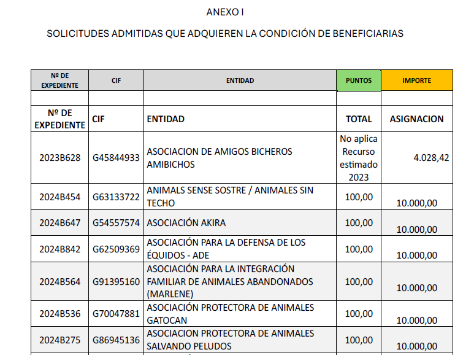
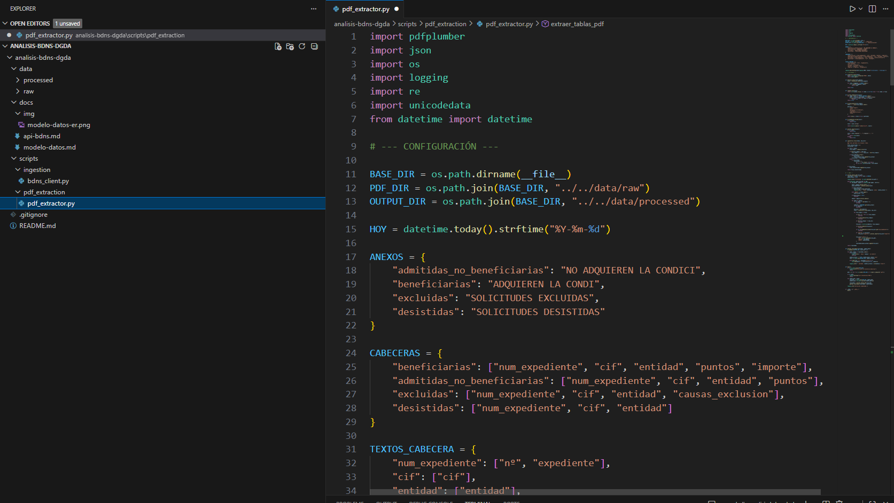
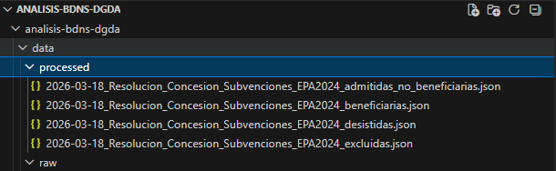
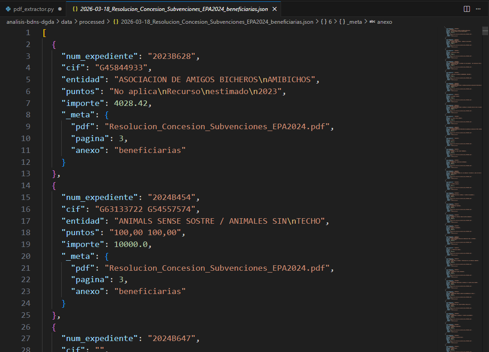
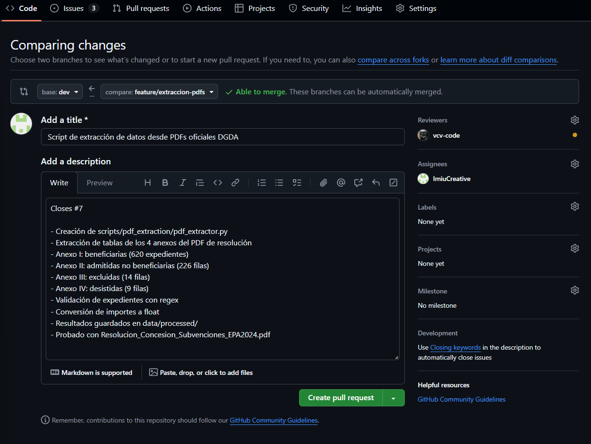
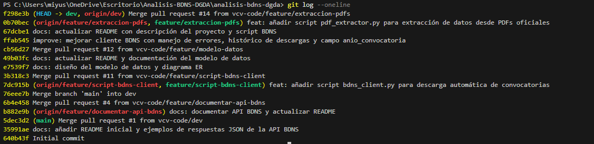

# Análisis de subvenciones de bienestar animal (BDNS + DGDA)

Proyecto intermodular de **2º FPGS Desarrollo de Aplicaciones Web (DAW)**.

---

## Autores

Proyecto desarrollado por:

- Miyuki Salvador
- Verónica Corpa

---

## Objetivos del proyecto

El proyecto consiste en el desarrollo de una **plataforma web para analizar subvenciones públicas relacionadas con bienestar animal en España**, centralizando información actualmente dispersa y permitiendo su consulta, filtrado y visualización a partir de datos abiertos y documentos oficiales.

El sistema permitirá:

- centralizar información de subvenciones públicas
- consultar convocatorias y beneficiarios
- aplicar filtros por año, territorio y tipo de beneficiario
- mostrar resultados en tablas
- generar gráficos de análisis
- ofrecer información útil a entidades que quieran solicitar subvenciones

El proyecto busca facilitar el análisis y comprensión de las políticas públicas de bienestar animal a partir de datos abiertos.

---

## Documentación técnica

La documentación detallada del proyecto se encuentra en la carpeta `docs`.

- [Análisis de la API BDNS](docs/api-bdns.md)
- [Modelo de datos del sistema](docs/modelo-datos.md)

---

## Arquitectura prevista del sistema

El sistema sigue una arquitectura cliente–servidor basada en una API REST:

```
API externa BDNS + PDFs oficiales
      ↓
Backend Python
      ↓
Base de datos MySQL / MariaDB
      ↓
API propia
      ↓
Frontend
```

---

## Modelo de datos (diagrama ER)

El modelo de datos del sistema se describe en detalle en la documentación técnica y se ha diseñado para permitir análisis estadísticos sobre subvenciones públicas, como evolución de financiación por año, entidades con mayor financiación o causas más frecuentes de exclusión.

<p align="center">
  <a href="docs/img/modelo-datos-er.png">
    
  </a>
</p>

---

## Tecnologías 

| Área | Tecnologías |
|-----|-------------|
| Frontend | HTML, CSS, JavaScript, Chart.js |
| Backend | Python (scripts de ingestión y API REST) |
| Base de datos | MySQL / MariaDB |
| Infraestructura | Docker, Nginx |
| Control de versiones | Git, GitHub |
| Fuentes de datos | API BDNS, PDFs oficiales |

### Frontend

El frontend permitirá explorar los datos mediante filtros y visualizaciones.

### Backend

El backend será responsable de:

- consultar APIs externas
- procesar los datos
- almacenarlos en base de datos
- exponerlos al frontend mediante una API

### Base de datos

Se almacenarán:

- convocatorias
- concesiones
- beneficiarios
- importes
- metadatos de las subvenciones

### Infraestructura

La aplicación se desplegará mediante contenedores Docker y un servidor Nginx como proxy inverso.

---

## Fuentes de datos analizadas

Los datos se obtienen de fuentes externas, se procesan y posteriormente se almacenan para permitir su análisis y visualización.

### Base de Datos Nacional de Subvenciones (BDNS)

Documentación oficial:

https://www.infosubvenciones.es/bdnstrans/doc

Endpoints explorados:

- `/convocatorias/busqueda`
- `/concesiones/busqueda`

---

### Líneas de subvención analizadas

**Subvenciones a entidades de protección animal**

Convocatorias identificadas en BDNS desde **2021 en adelante**.

**Subvenciones a entidades locales para la gestión de colonias felinas**

Convocatorias identificadas desde **2023 en adelante**.

---

### Resultados de la investigación inicial

Las convocatorias aparecen correctamente en la API.

Sin embargo, las **concesiones de la Dirección General de Derechos de los Animales (DGDA)** no aparecen en el endpoint público, aunque existen resoluciones oficiales con beneficiarios.

En cambio, las concesiones de **otras administraciones (locales y autonómicas)** sí aparecen en la API.

Esto implica que la API pública **no contiene toda la información necesaria para el análisis**.

---

### Datos disponibles en los PDFs oficiales

Como alternativa, se prevé utilizar los **PDFs de resoluciones publicados en la página web oficial de la DGDA**, que contienen tablas estructuradas con información detallada.

#### Datos de asociaciones

Los campos incluyen:

- CIF
- expediente
- entidad
- línea de actuación
- puntuación
- importe concedido

#### Datos de entidades locales

Los campos incluyen:

- NIF
- expediente
- entidad local
- porcentaje de cofinanciación
- número de actuaciones
- puntuación
- importe concedido

En algunos casos aparecen **agrupaciones de entidades con reparto de importes**.

---

## Estrategia técnica prevista

Debido a las limitaciones de la API BDNS, la estrategia técnica prevista es **combinar dos fuentes de datos**.

```
API BDNS
   ↓
obtener convocatorias
   ↓
detectar documentos PDF asociados
   ↓
extraer tablas de los PDFs
   ↓
convertir a JSON
   ↓
guardar en base de datos
   ↓
mostrar resultados en frontend
```

Esto permitirá construir un **dataset estructurado de beneficiarios y concesiones**.

---

## Herramientas para extracción de PDF

Se evaluarán diferentes librerías de Python para extraer tablas:

- `tabula-py`
- `camelot`
- `pdfplumber`

La elección dependerá de cuál funcione mejor con las tablas de las resoluciones.

---

## Estructura provisional del proyecto

```
backend/
    api/            # endpoints de la API
    services/       # lógica de negocio
    models/         # modelos de datos

frontend/
    js/             # scripts del frontend
    css/            # estilos
    assets/         # imágenes y recursos

data/
    raw/            # datos originales descargados
    processed/      # datos procesados

scripts/
    ingestion/      # descarga de datos desde BDNS
    pdf_extraction/ # extracción de datos de PDFs

docs/
    img/            # diagramas e imágenes de la documentación

docker/
    configuración de contenedores
```

Descripción general:

- **backend/** → lógica del servidor y API
- **frontend/** → interfaz web
- **data/** → datos descargados o procesados
- **scripts/** → scripts de obtención y procesamiento de datos
- **docs/** → documentación técnica del proyecto
- **docker/** → configuración de contenedores

---

## Scripts de ingestión de datos

Actualmente el proyecto incluye un primer script para descargar datos desde la API BDNS.

### Descarga de convocatorias BDNS

Archivo:

`scripts/ingestion/bdns_client.py`

Este script realiza las siguientes tareas:

- consulta el endpoint `/convocatorias/busqueda` de la API BDNS
- gestiona la paginación de resultados
- descarga convocatorias relacionadas con bienestar animal
- guarda los resultados como archivos JSON en `data/raw/`

El script también incluye pequeñas mejoras para mejorar su robustez:

- control básico de errores de conexión
- timeout en las peticiones HTTP
- eliminación de duplicados por `numeroConvocatoria`
- generación automática del campo `anio_convocatoria`
- guardado de archivos con fecha para mantener histórico de descargas

Ejecutar el script:

```bash
pip install requests
python scripts/ingestion/bdns_client.py
```

---

## Estado actual del proyecto

Fase actual: **análisis de fuentes de datos y primeras herramientas de ingestión de datos**.

Durante esta fase se ha desarrollado un primer script en Python para descargar convocatorias desde la API BDNS y analizar la estructura real de los datos.

Se ha confirmado que:

- la API BDNS funciona correctamente
- las convocatorias están disponibles
- las concesiones de la DGDA no aparecen en el endpoint público
- los datos de beneficiarios existen en PDFs estructurados

Por tanto, el proyecto probablemente requerirá **combinar datos de la API BDNS con extracción de información de PDFs**.

### Datos de ejemplo de la API

Para facilitar el desarrollo y análisis inicial de la API BDNS se han incluido algunos ejemplos de respuestas JSON en:

```
data/raw/
```

Estos archivos contienen respuestas reales de la API correspondientes a convocatorias de subvenciones relacionadas con bienestar animal.

Actualmente se incluyen ejemplos de:

- convocatorias de subvenciones a entidades de protección animal
- convocatorias de subvenciones a entidades locales para gestión de colonias felinas
- una convocatoria individual utilizada para analizar la estructura completa de la respuesta de la API

Estos datos se utilizan como referencia para el análisis del modelo de datos y el desarrollo del backend.

---

## Desarrollo

Clonar el repositorio:

```bash
git clone git@github.com:vcv-code/analisis-bdns-dgda.git
cd analisis-bdns-dgda
```

Crear rama de desarrollo:

```bash
git checkout -b dev
git push -u origin dev
```

Sincronizar repositorio:

```bash
git checkout dev
git pull
```

Flujo de trabajo:

```
main
dev
feature/*
```

---

## Gestión del proyecto

La planificación y seguimiento de tareas se realiza mediante **GitHub Projects**.

Las funcionalidades y tareas de desarrollo se registran como **Issues**, que posteriormente se organizan en un tablero tipo Kanban con columnas como:

- Backlog
- To do
- In progress
- Review
- Done

Cada funcionalidad o investigación se desarrolla en una rama `feature/*` y posteriormente se integra en la rama `dev` mediante Pull Requests.

---

## Día 3 — Extracción de datos desde PDFs oficiales

### Contexto

Mientras Verónica continuaba con el modelo de base de datos,
yo comencé el trabajo correspondiente al Issue #7: la extracción
de datos de beneficiarios e importes desde los PDFs oficiales de resoluciones
publicados por la Dirección General de los Derechos de los Animales (DGDA).

Esta tarea era necesaria porque las concesiones de estas subvenciones no
aparecen en el endpoint `/concesiones/busqueda` de la API BDNS, por lo que
la única fuente disponible son los documentos PDF oficiales.

---

### Análisis previo de los PDFs

Se descargó `Resolucion_Concesion_Subvenciones_EPA2024.pdf` desde la web
oficial del Ministerio:

`https://www.dsca.gob.es/es/derechos-sociales/derechos-animales/subvenciones/EPA`

El PDF contiene 4 anexos:

| Anexo | Contenido | Columnas |
|-------|-----------|----------|
| Anexo I | Beneficiarias | Nº expediente, CIF, Entidad, Puntos, Importe |
| Anexo II | Admitidas no beneficiarias | Nº expediente, CIF, Entidad, Puntos |
| Anexo III | Excluidas | Nº expediente, CIF, Entidad, Causas de exclusión |
| Anexo IV | Desistidas | Nº expediente, CIF, Entidad |



---

### Configuración del entorno
```bash
git checkout dev
git pull
git checkout -b feature/extraccion-pdfs
mkdir scripts\pdf_extraction
New-Item scripts\pdf_extraction\pdf_extractor.py
mkdir data\processed
pip install pdfplumber
```

---

### Script pdf_extractor.py

Se creó `scripts/pdf_extraction/pdf_extractor.py` con las siguientes
funcionalidades:

- Detección automática de cada anexo mediante palabras clave
- Cabeceras definidas manualmente para evitar problemas con celdas partidas
- Validación del formato de expediente con regex (`\d{4}[A-Z]\d+`)
- Conversión de importes a float
- Reconstrucción de filas partidas en varias líneas
- Filtrado de texto de firma electrónica
- Metadatos por fila (PDF, página, anexo)
- Resultados guardados en `data/processed/` con fecha en el nombre



---

### Resultados
```
INFO - Procesando: Resolucion_Concesion_Subvenciones_EPA2024.pdf
INFO -   Página 3: anexo 'beneficiarias'
INFO -   Página 22: anexo 'admitidas_no_beneficiarias'
INFO -   Página 27: anexo 'excluidas'
INFO -   Página 29: anexo 'desistidas'
INFO -   Guardado: 2026-03-18_..._admitidas_no_beneficiarias.json (226 filas)
INFO -   Guardado: 2026-03-18_..._beneficiarias.json (620 filas)
INFO -   Guardado: 2026-03-18_..._excluidas.json (14 filas)
INFO -   Guardado: 2026-03-18_..._desistidas.json (9 filas)
INFO - Extracción completada.
```

Verificación de expedientes únicos en Anexo I:
```bash
python -c "import json; data=json.load(open('data/processed/2026-03-18_Resolucion_Concesion_Subvenciones_EPA2024_beneficiarias.json', encoding='utf-8')); exps=set(d['num_expediente'] for d in data); print(f'Expedientes únicos: {len(exps)}')"
```

Resultado: `Expedientes únicos: 620`





---

### Integración en el repositorio
```bash
git add .
git commit -m "feat: añadir script pdf_extractor.py para extracción de datos desde PDFs oficiales"
git push --set-upstream origin feature/extraccion-pdfs
```

PR abierto hacia `dev` solicitando revisión a (nombre compañera).


```bash
git checkout dev
git pull
```

