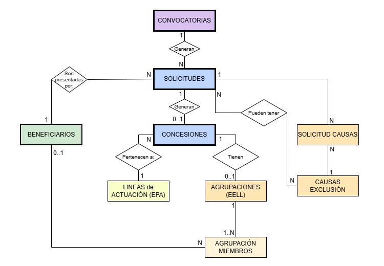

# Modelo de datos del sistema

## 1. Introducción

El modelo de datos del sistema se ha diseñado a partir de la integración de dos fuentes principales:

- La API de la Base de Datos Nacional de Subvenciones (BDNS), que proporciona información estructurada sobre convocatorias públicas.
- Los documentos oficiales publicados por la Dirección General de los Derechos de los Animales (DGDA), que contienen información sobre concesiones y exclusiones.

Tras el proceso de extracción, limpieza y unificación, se obtiene un **dataset final consolidado** que combina la información de convocatorias con los datos de concesiones publicados en los documentos oficiales.

---

## 2. Fuentes de datos utilizadas

### 2.1 API BDNS

La API BDNS permite obtener información sobre convocatorias públicas, incluyendo:

- código BDNS
- descripción
- organismo convocante
- fecha de publicación
- año

Esta información se utiliza para construir la tabla **convocatorias**, que actúa como referencia para las concesiones.

### 2.2 Documentos oficiales (PDF y XML)

Los documentos oficiales publicados por la DGDA contienen:

- listados de concesiones
- importes concedidos
- puntuaciones
- entidades beneficiarias
- causas de exclusión (solo en EELL 2025)
- tramos (solo en EELL 2025)

---

## 3. Proceso de transformación de los datos

El diseño del modelo de datos se ha realizado a partir del análisis de los datos disponibles y siguiendo un proceso de transformación desde la información original hacia un modelo relacional.

Este proceso se ha desarrollado en tres pasos principales:

1. Identificación de las entidades principales presentes en los datos.
2. Identificación de las relaciones entre dichas entidades.
3. Conversión de las entidades y relaciones en tablas de una base de datos relacional.

---

## 4. Entidades principales del modelo de datos

A partir del análisis de los datos obtenidos de la API BDNS y de los documentos oficiales, se identificaron las principales entidades implicadas en el proceso de concesión de subvenciones.

Las entidades del modelo implementado son:

- Convocatorias
- Beneficiarios
- Solicitudes
- Concesiones
- Agrupaciones de entidades locales
- Miembros de agrupación

Adicionalmente, se contemplan como **entidades de fase futura** (no implementadas en el modelo físico actual):

- Causas de exclusión
- Solicitud_causas (tabla intermedia)

---

### 4.1 Convocatorias

La entidad **Convocatorias** representa cada convocatoria oficial de subvenciones publicada por la administración pública.

La información sobre convocatorias se obtiene principalmente a través de la API BDNS.

Cada convocatoria puede recibir múltiples solicitudes por parte de entidades interesadas.

Campos principales:

- id_convoc (PK)
- num_convoc
- titulo_convoc
- tipo_convoc — ENUM: `epa`, `eell`
- anio_convocatoria
- fecha_convocatoria
- fecha_resolucion

El campo `titulo_convoc` corresponde al campo **descripcion** devuelto por la API.

El campo `anio_convocatoria` se añade de forma explícita para facilitar consultas estadísticas y la generación de gráficos de evolución temporal en el frontend.

---

### 4.2 Beneficiarios

La entidad **Beneficiarios** representa las entidades que solicitan las subvenciones.

Estas entidades pueden ser de dos tipos:

- asociaciones de protección animal
- entidades locales (ayuntamientos)

Campos principales:

- id_benef (PK)
- cif — UNIQUE
- nombre
- tipo_benef — ENUM: `asociacion`, `entidad_local`

Un beneficiario puede presentar varias solicitudes en distintas convocatorias.

En el caso de las entidades locales, estas pueden participar adicionalmente en agrupaciones de ayuntamientos, mientras que las asociaciones lo hacen únicamente como beneficiarios individuales.

---

### 4.3 Solicitudes

La entidad **Solicitudes** representa cada solicitud presentada por una entidad para participar en una convocatoria de subvenciones.

Cada solicitud está asociada a una convocatoria concreta y a una entidad beneficiaria.

Campos principales:

- id_solic (PK)
- id_convoc (FK → convocatorias)
- id_benef (FK → beneficiarios)
- num_expediente — UNIQUE. Para registros EPA sin número de expediente real se generan IDs sintéticos con formato `SIN_EXP_YYYY_NNN`.
- puntuacion
- estado — ENUM: `concedida`, `no_beneficiaria`, `excluida`, `desistida`, `denegada`

Los cinco valores posibles del campo `estado` cubren los distintos resultados del proceso administrativo:

- **concedida** — solicitud aprobada y subvención concedida
- **no_beneficiaria** — solicitud admitida pero no seleccionada para subvención
- **excluida** — solicitud rechazada por incumplimiento de requisitos
- **desistida** — la entidad solicitante renunció al proceso
- **denegada** — solicitud denegada en convocatorias EPA

---

### 4.4 Concesiones

La entidad **Concesiones** representa las subvenciones que finalmente han sido concedidas.

Solo existe una concesión cuando el estado de la solicitud correspondiente es `concedida`.

Campos principales:

- id_conces (PK)
- id_solic (FK → solicitudes) — UNIQUE (relación 1:1 con solicitudes)
- importe — DECIMAL(12,2)
- linea — ENUM: `colonias_felinas`, `proteccion_animal`, `eell`
- tramo — TINYINT. Campo específico de EELL 2025 que indica el tramo de subvención asignado. NULL para convocatorias que no aplican.

La línea de actuación se implementa como campo ENUM en lugar de tabla separada, dado que el número de valores es reducido y estable (ver decisión 6.4).

---

### 4.5 Agrupaciones de entidades locales

En determinadas convocatorias EELL, las solicitudes pueden presentarse en forma de **agrupaciones de ayuntamientos**.

Estas agrupaciones tienen una entidad representante y varios miembros.

Campos principales:

- id_agrup (PK)
- id_conces (FK → concesiones)
- id_represent (FK → beneficiarios)
- cofinanciacion
- num_actuaciones

---

### 4.6 Miembros de agrupación

La entidad **Miembros de agrupación** representa los ayuntamientos que forman parte de una agrupación.

Campos principales:

- id_agrupM (PK)
- id_agrup (FK → agrupaciones)
- id_benefic (FK → beneficiarios)
- importe_conced

---

### 4.7 Causas de exclusión *(fase futura)*

Las solicitudes que no cumplen los requisitos establecidos pueden ser excluidas por distintos motivos, que aparecen codificados numéricamente en los documentos oficiales.

Esta entidad y la tabla intermedia `solicitud_causas` están **contempladas en el modelo conceptual pero no implementadas en el modelo físico actual**, ya que su población requiere un proceso de extracción adicional todavía pendiente.

Campos previstos:

- id_causa (PK)
- descrip_exclu

La relación prevista es muchos a muchos entre `solicitudes` y `causas_exclusion`, implementada mediante la tabla intermedia `solicitud_causas` con campos `id_soli` (FK) e `id_causa` (FK), con clave primaria compuesta.

---

## 5. Relaciones entre entidades

### Convocatorias y solicitudes

```
CONVOCATORIAS 1 ─── N SOLICITUDES
```

Una convocatoria puede recibir múltiples solicitudes. Cada solicitud pertenece únicamente a una convocatoria concreta.

---

### Beneficiarios y solicitudes

```
BENEFICIARIOS 1 ─── N SOLICITUDES
```

Una misma entidad puede presentar varias solicitudes en diferentes convocatorias. Cada solicitud pertenece a un único beneficiario.

---

### Solicitudes y concesiones

```
SOLICITUDES 1 ─── 0..1 CONCESIONES
```

Una solicitud puede terminar en concesión o no. Solo se genera concesión cuando el estado es `concedida`.

---

### Concesiones y agrupaciones

```
CONCESIONES 1 ─── 0..1 AGRUPACIONES
```

En determinadas subvenciones EELL, las concesiones pueden corresponder a agrupaciones de ayuntamientos.

---

### Agrupaciones y miembros de agrupación

```
AGRUPACIONES 1 ─── 1..N AGRUPACION_MIEMBROS
```

Cada agrupación está formada por varios ayuntamientos.

---

### Beneficiarios y miembros de agrupación

```
BENEFICIARIOS 1 ─── N AGRUPACION_MIEMBROS
```

Un mismo ayuntamiento puede participar en distintas agrupaciones en diferentes convocatorias.

---

### Solicitudes y causas de exclusión *(relación prevista — fase futura)*

```
SOLICITUDES N ─── N CAUSAS_EXCLUSION  (vía SOLICITUD_CAUSAS)
```

Una solicitud puede estar asociada a varias causas de exclusión, y una misma causa puede aplicarse a múltiples solicitudes. Esta relación se implementará en una fase futura del proyecto.

---

## 6. Decisiones de diseño del modelo de datos

Durante el proceso de diseño del modelo de datos se tomaron diversas decisiones para adaptar la estructura de la base de datos a las características reales de las fuentes de información.

---

### 6.1 Campo anio_convocatoria

Inicialmente el modelo solo contemplaba el campo `fecha_convocatoria`. Sin embargo, para realizar análisis estadísticos y generar visualizaciones por año sería necesario utilizar funciones como `YEAR(fecha_convocatoria)`, lo que complica las consultas y puede afectar al rendimiento.

Por este motivo se decidió añadir el campo `anio_convocatoria`, que permite realizar consultas más simples y facilita la generación de gráficos en el frontend mediante librerías como Chart.js.

---

### 6.2 Estados posibles de una solicitud

El modelo contempla cinco estados posibles para una solicitud, en lugar de los tres inicialmente previstos:

- `concedida` — aprobada
- `no_beneficiaria` — admitida pero no seleccionada (añadida al analizar los datos reales)
- `excluida` — rechazada por incumplimiento
- `desistida` — renuncia de la entidad solicitante
- `denegada` — denegación específica de convocatorias EPA

El estado `no_beneficiaria` no fue identificado en el diseño inicial y se añadió al verificar los datos reales del dataset unificado. Este estado es especialmente relevante en las convocatorias EELL, donde el número de solicitudes admitidas supera las plazas disponibles.

---

### 6.3 IDs sintéticos para registros EPA sin expediente

Algunos registros EPA de convocatorias anteriores a 2024 no incluyen número de expediente en los documentos oficiales. Para no descartar estos registros y mantener la integridad del dataset, se generan identificadores sintéticos con el formato `SIN_EXP_YYYY_NNN` (donde YYYY es el año y NNN es un contador secuencial por año).

Estos IDs permiten cargar todos los registros en la base de datos respetando la restricción UNIQUE del campo `num_expediente`.

---

### 6.4 Representación de las líneas de actuación

En el diseño conceptual inicial se incluyó una tabla específica para representar las líneas de actuación (colonias felinas, protección animal, etc.).

No obstante, dado que el número de valores es reducido y estable, en la implementación final se optó por simplificar este diseño utilizando un campo `ENUM` dentro de la tabla de concesiones:

```sql
linea ENUM('colonias_felinas', 'proteccion_animal', 'eell')
```

Esta decisión simplifica el modelo sin perder información relevante.

---

### 6.5 Campo tramo en concesiones

Las concesiones EELL 2025 incluyen un campo `tramo` que indica la banda de subvención asignada a cada entidad. Este campo es específico de esa convocatoria y no aplica a las demás.

Se ha incorporado directamente en la tabla `concesiones` como campo `TINYINT` con valor `NULL` para los registros de otras convocatorias, en lugar de crear una tabla o subtipo adicional que complique el modelo.

---

### 6.6 Causas de exclusión como fase futura

En los documentos oficiales se indica que una solicitud puede estar excluida por varias causas, representadas mediante códigos numéricos. Una posible simplificación habría sido almacenar estas causas directamente como texto o como un campo JSON dentro de la tabla de solicitudes.

Sin embargo, esta aproximación dificultaría las consultas analíticas (por ejemplo, identificar las causas más frecuentes). Por este motivo se mantiene la estructura normalizada mediante las tablas `causas_exclusion` y `solicitud_causas` en el modelo conceptual.

La implementación de estas tablas se pospone a una **fase futura** del proyecto, ya que la extracción automática de causas de exclusión desde los documentos oficiales requiere un trabajo adicional de parsing todavía pendiente.

---

### 6.7 Separación EPA / EELL en una única tabla de solicitudes

Los datos de convocatorias EPA y EELL comparten la misma estructura principal (expediente, beneficiario, estado, convocatoria) y se han unificado en una única tabla `solicitudes`. La distinción entre tipos se realiza a través de la relación con `convocatorias`, que incluye el campo `tipo_convoc` con valores `epa` o `eell`.

Esta decisión simplifica las consultas transversales (por ejemplo, comparar tasas de exclusión entre EPA y EELL) sin necesidad de JOINs adicionales.

---

## 7. Diagrama entidad–relación del modelo

A partir de las entidades identificadas y de las relaciones definidas entre ellas se elaboró un diagrama entidad–relación (ER) que representa la estructura general del modelo de datos del sistema.

El diagrama incluye las entidades del modelo implementado (en trazo continuo) y las entidades conceptuales de fase futura (marcadas como "Tablas conceptuales. No se implementan en el modelo físico."):



> **Nota sobre el diagrama:** las entidades `causas_exclusion` y `solicitud_causas` aparecen representadas en el diagrama con sus conexiones a `solicitudes` para reflejar el diseño conceptual previsto. La línea entre `solicitudes` y estas entidades indica una relación planificada para una fase futura del proyecto.

---

## 8. Herramientas utilizadas para el diseño del modelo

### diagrams.net (draw.io)

Herramienta principal utilizada para el diseño conceptual del modelo. Permite crear diagramas ER de forma visual con entidades, relaciones y conectores. Entre sus ventajas destacan el uso gratuito, el funcionamiento online y la posibilidad de exportar en PNG o PDF.

### dbdiagram.io

Herramienta útil para generar diagramas a partir de una definición textual de las tablas. Especialmente práctica cuando el modelo lógico ya está definido y se quiere visualizar rápidamente las relaciones.

### MySQL Workbench / DBeaver

Una vez implementada la base de datos, estas herramientas permiten generar automáticamente un diagrama ER a partir de las tablas existentes (*Reverse Engineering*), lo que facilita documentar la estructura real del sistema incluyendo tablas, claves primarias, claves foráneas y relaciones.
