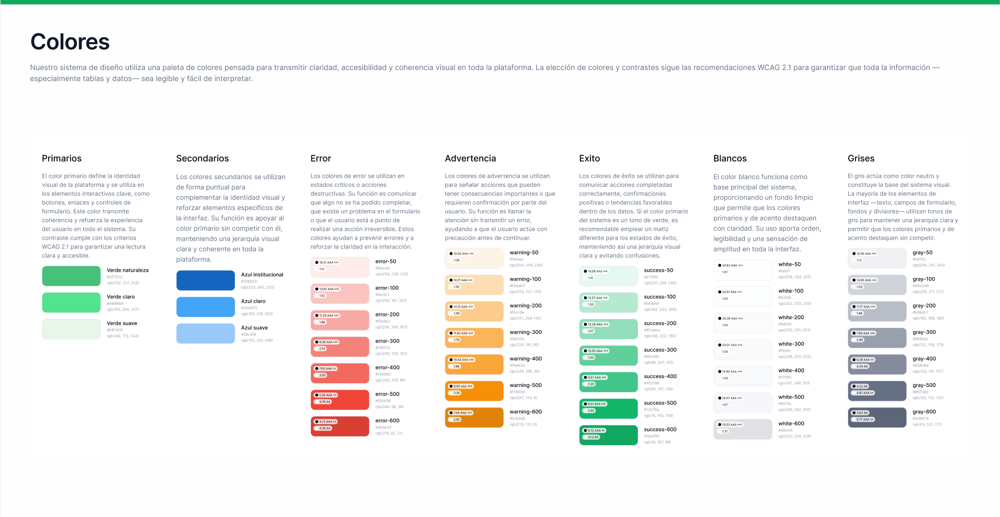
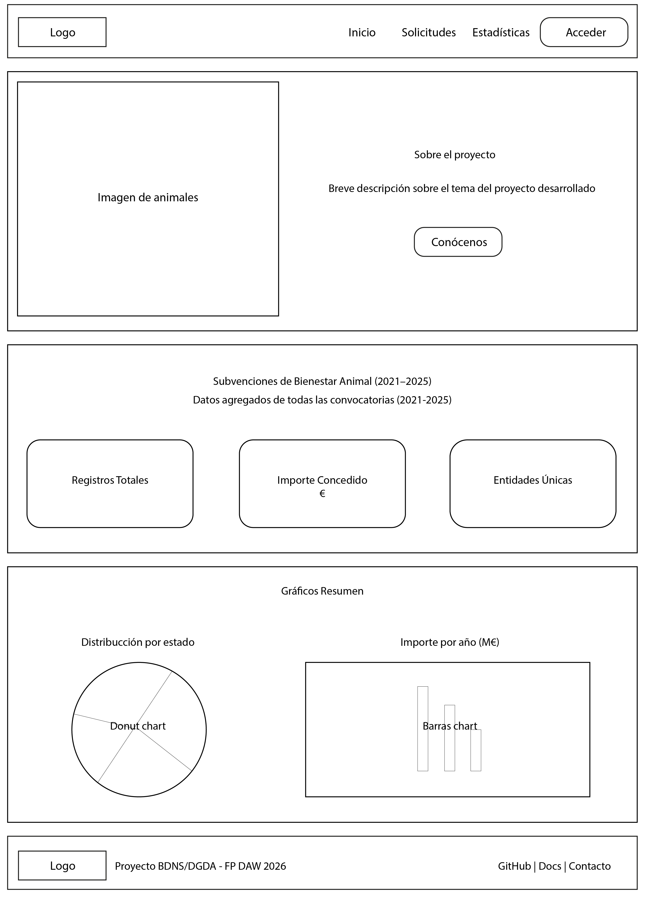
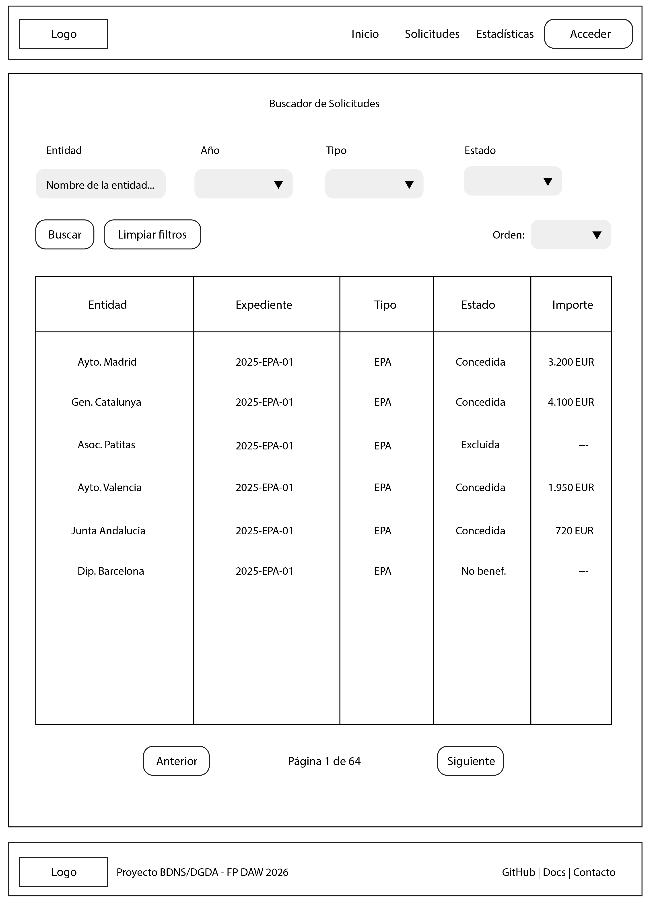
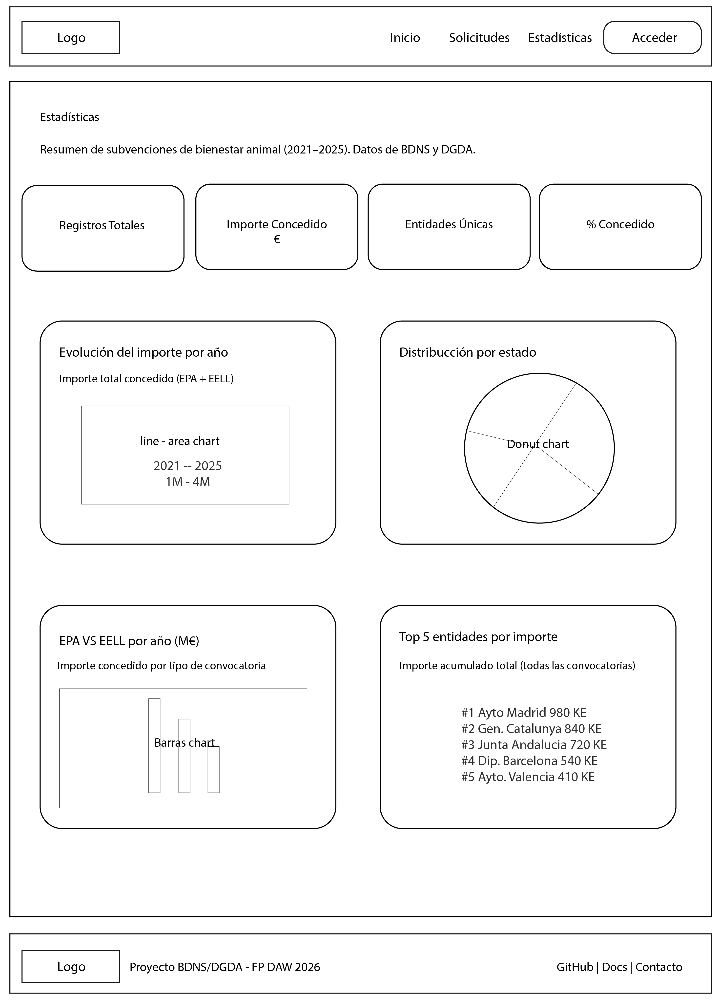
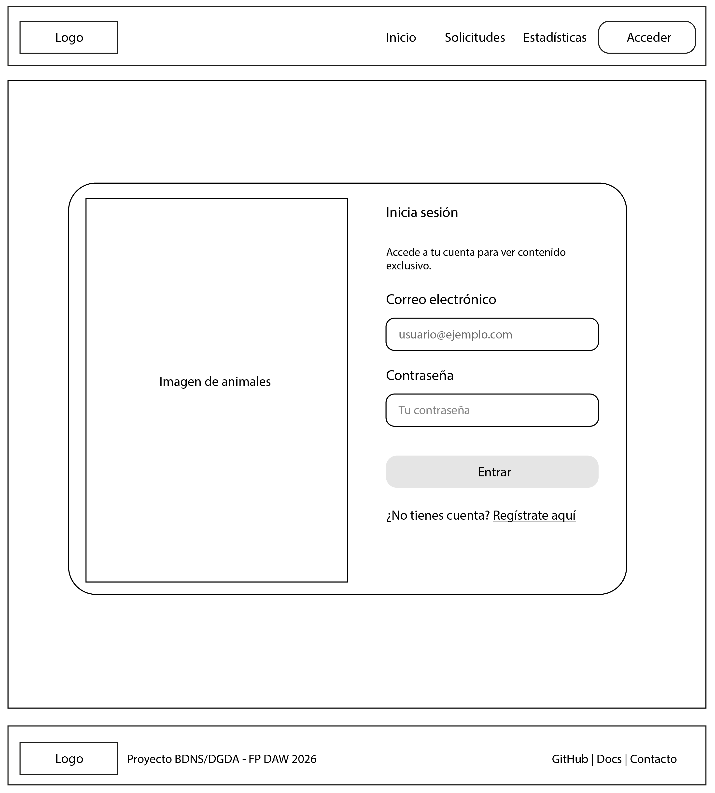
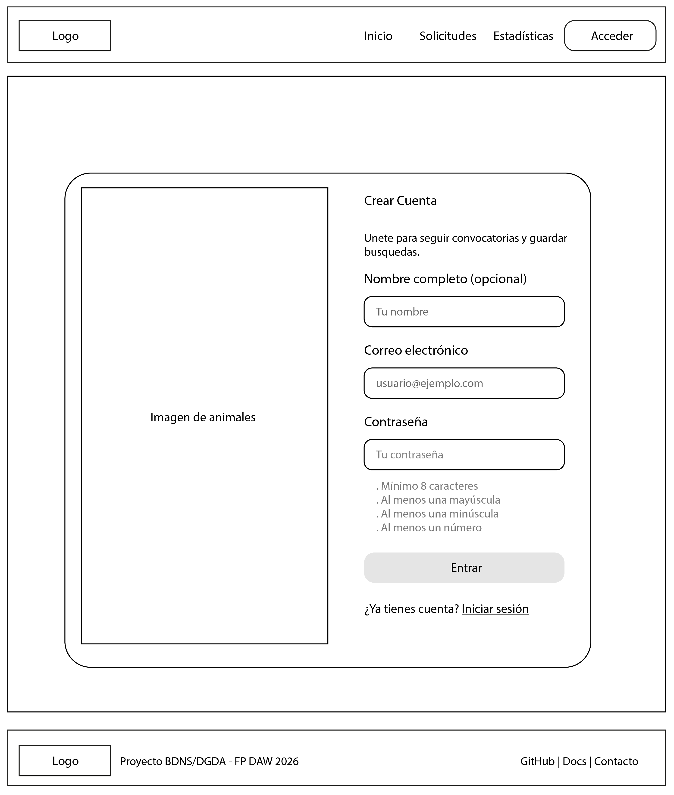

# Diseño del Frontend

## Proyecto BDNS / DGDA – Subvenciones Bienestar Animal

Este documento recoge la guía visual, los wireframes, los componentes y la estructura base del frontend del proyecto. Sirve como referencia para la implementación en HTML, CSS y JS.

---

## Índice

1. Estructura del frontend  
2. Paleta de colores  
3. Tipografía
4. Logo del proyecto
5. Sistema de espaciado  
6. Componentes base  
7. Wireframes
8. Fuentes de inspiración de diseño
9. Accesibilidad  
10. Referencias

---

## 1. Estructura del frontend

```text
frontend/
├── docs/                               ← documentación del proyecto
│   ├── auditoria-frontend.md
│   ├── diseño.md                       ← este documento
│   ├── especificaciones-frontend.md
│   └── patrones.md
├── css/
│   └── styles.css
├── js/
│   ├── admin.js
│   ├── auth.js
│   ├── entidad.js
│   ├── estadisticas-eell.js
│   ├── estadisticas-epas.js
│   ├── exclusivo.js
│   ├── home.js
│   ├── mapa-ccaa.js
│   ├── modal-entidad.js
│   ├── modal-grafica.js
│   ├── navbar.js
│   ├── privado.js
│   ├── recuperar-password.js
│   ├── reset-password.js
│   ├── scroll-arriba.js
│   ├── solicitudes.js
│   └── utils.js
├── assets/
│   ├── geojson/
│   │   └── ccaa.geojson
│   ├── guia-estilo/
│   │   ├── colores.png
│   │   ├── tipografia.png
│   │   └── wireframes_subvenciones_bienestar_animal.pdf
│   ├── img/
│   │   ├── home/                       ← imágenes alternativas del hero (portada)
│   │   ├── logos/                      ← logos de entidades y organizaciones
│   │   ├── error404.webp               ← imagen página 404
│   │   ├── gato500.webp                ← imagen página 50x
│   │   ├── perro-gato.png              ← imagen login y registro
│   │   └── logo.png
│   └── wireframes/
│       ├── estadisticas.png
│       ├── home.png
│       ├── login.png
│       ├── pagFiltros.png
│       └── registro.png
├── scripts/
│   └── color-privado.sh
├── index.html                          ← Home
├── buscador.html                       ← Buscador avanzado
├── solicitudes.html                    ← Listado de solicitudes con filtros
├── estadisticas-epas.html              ← Dashboard EPAs
├── estadisticas-eell.html              ← Dashboard EELL
├── entidad.html                        ← Ficha de entidad
├── exclusivo.html                      ← Contenido exclusivo (zona privada)
├── privado.html                        ← Perfil de usuario (zona privada)
├── admin.html                          ← Panel de administración
├── login.html
├── recuperar-password.html
├── reset-password.html
├── verificar-email.html
├── recursos.html                       ← Recursos y organizaciones
├── aviso-legal.html
├── privacidad.html
├── 404.html
└── 50x.html
```

---

## 2. Paleta de colores



### Colores principales

- **Verde naturaleza (primario)** — `#47C079`  
- **Verde claro (hover / acentos)** — `#52E38E`  
- **Verde suave (fondos)** — `#E8F5E9`
- **Verde botones** — `#2E7D32`  
- **Verde cabeceras de tabla** — `#2E6B4F`  
- **Verde institucional oscuro (navbar)** — `#1A3429`

### Colores secundarios

- **Azul institucional** — `#1565C0`  
- **Azul claro** — `#42A5F5`
- **Ámbar (botón login / acento navbar)** — `#D97706`

### Neutros para tablas y UI

- **Gris muy claro** — `#F5F5F5`  
- **Gris medio** — `#E0E0E0`  
- **Gris texto** — `#616161`  
- **Negro suave** — `#212121`

### Zona privada

Colores exclusivos de `privado.html` y `exclusivo.html`. Editables con `scripts/color-privado.sh` sin tocar el código.

- **Banner superior** (`--banner-privado`) — `#2D6A4F`  
- **Fondo del cuerpo** (`--fondo-privado`) — `#FAF4EE`  
- **Hover tarjeta exclusivo** (`--hover-privado`) — `#E8F2EC`

### Estados

- **Concedida** — `#2E7D32`  
- **No beneficiaria** — `#C62828`  
- **Excluida** — `#EF6C00`  
- **Desistida** — `#6A1B9A`

---

## 3. Tipografía

**Inter** (Google Fonts) como fuente principal, con **Segoe UI** como fallback en Windows. Ideal para dashboards y tablas.


### Jerarquía tipográfica

- **Títulos**: Inter Bold 32–48 px  
- **Subtítulos**: Inter Medium 20–24 px  
- **Texto normal**: Inter Regular 16 px  
- **Tablas**: Inter Regular 14 px  

---

## 4. Logo del proyecto

A continuación se presenta el logotipo utilizado para el proyecto de análisis de subvenciones para protección animal y gestión de colonias felinas. Representa visualmente la misión del sistema: la transparencia institucional y el bienestar animal.

El diseño combina un escudo dividido en dos mitades: la izquierda con un edificio institucional (referencia a la administración pública) y la derecha con las siluetas de un perro y un gato (referencia al bienestar animal). La composición en blanco y negro transmite seriedad y carácter oficial.


### Variantes previstas

- Versión monocromática en negro (principal, la actual)  
- Versión invertida (blanco sobre fondo oscuro)  
- Versión a color (posible mejora futura, con la paleta verde del proyecto)  

### Usos recomendados

- Encabezado (header) de la aplicación web  
- Documentación del proyecto  
- Material de presentación  

### Usos no recomendados

- Reducir el logotipo por debajo de 32px  
- Colocarlo sobre fondos con poco contraste  
- Alterar proporciones o disposición  
- Añadir sombras o efectos no contemplados en el diseño original  

### Área de seguridad

Se recomienda mantener un margen mínimo equivalente al 20% del ancho del escudo alrededor del logotipo para asegurar su correcta legibilidad en cualquier contexto.

---

## 5. Sistema de espaciado

Escala basada en múltiplos de 8:

- 8 px  
- 16 px  
- 24 px  
- 32 px  
- 48 px  

Escala de referencia: **8 / 16 / 24 / 32 / 48 px**

---

## 6. Componentes base

### Botón primario

- Fondo: `#2E7D32`  
- Texto: blanco  
- Radio: 8 px  
- Padding: 16 px 24 px  

### Botón secundario

- Borde: `#2E7D32`  
- Texto: verde  
- Fondo: blanco  

### Input

- Borde: `#E0E0E0`  
- Radio: 6 px  
- Altura: 44 px  

### Select

- Igual que input, con icono ▼  

### Card

- Fondo: blanco  
- Sombra suave  
- Radio: 12 px  
- Padding: 24 px  

### Tabla

- Header gris claro  
- Filas alternas gris muy suave  
- Texto 14 px  

### Barra de navegación

- Fondo: `#1A3429` (verde institucional oscuro)  
- Botón de login: fondo ámbar `#D97706`  
- Sombra inferior  
- Altura: 80 px  

---

## 7. Wireframes del sistema

Los siguientes wireframes representan la estructura visual inicial del proyecto
según el documento PDF de referencia.

---

### 7.1 Home (Página principal)

Elementos clave:

- Header con navegación superior.  
- Hero principal con título, subtítulo y CTA.  
- Métricas destacadas (solicitudes, importe, convocatorias…).  
- Accesos rápidos a buscador y estadísticas.  
- Sección de convocatorias recientes.  
- Bloque de transparencia con KPIs secundarios.  
- Footer institucional.

  

---

### 7.2 Buscador / Página de solicitudes (Listado + filtros)

Elementos clave:

- Filtros superiores: Año, Tipo, Estado, Buscar.  
- Tabla con columnas:
  - Entidad  
  - Expediente  
  - Tipo (EPA / EELL)  
  - Estado (concedida, excluida, desistida…)  
  - Importe  
- Paginación inferior.  
- Diseño orientado a lectura rápida y comparación.



---

### 7.3 Estadísticas (Dashboard)

Implementado en dos páginas separadas: `estadisticas-epas.html` (Entidades Privadas de Animales) y `estadisticas-eell.html` (Entidades Locales).

Elementos clave:

- Filtros superiores: Tipo y Año.  
- KPIs agregados:
  - Convocatorias  
  - EPA totales  
  - EELL totales  
  - Excluidas  
  - Desistidas  
- Gráficos:
  - Barras: importe concedido por año.  
  - Barras comparativas: EPA vs EELL.  
  - Tarta: reparto por estado.  
  - Líneas: evolución anual.  
- Estructura tipo dashboard, clara y analítica.



---

### 7.4 Login / Registro

Elementos clave:

- Formulario centrado.  
- Campos:
  - Email  
  - Contraseña  
- Botón "Entrar".  
- Enlace "Crear cuenta".  
- Estética minimalista y coherente con el resto del sistema.




> **Nota:** Los wireframes incluyen botones de acceso con Google y GitHub. Esta funcionalidad (OAuth) no está implementada en el backend actual y se reserva como **mejora futura**. La implementación real usa únicamente email y contraseña.

---

### 7.5 Perfil de usuario

Página `privado.html` (requiere sesión iniciada). Ver también sección 7.7 para el contenido exclusivo de la zona privada.

Elementos clave:

- Datos básicos del usuario (email, rol, fecha de alta).  
- Formulario para cambiar nombre o alias (`PUT /privado/cambiar-nombre`).  
- Formulario para cambiar contraseña (`PUT /privado/cambiar-contrasena`).  
- Botón "Cerrar sesión".  
- Acceso directo a `exclusivo.html` (solo usuarios con sesión activa).

---

### 7.6 Páginas de error

`404.html` y `50x.html` son páginas **estáticas** servidas directamente por Nginx con la directiva `error_page`. Funcionan aunque el backend esté caído.

Elementos clave:

- Mensaje claro y centrado.  
- Botones de acción:
  - Volver al inicio  
  - Reintentar (en 50x)  
- Diseño simple y accesible.  

---

### 7.7 Zona privada

Dividida en dos páginas separadas, ambas accesibles solo con sesión iniciada (token JWT válido):

- **`privado.html`** — Perfil del usuario autenticado (email, rol, botón "Cerrar sesión"). Corresponde a la ruta `/privado/perfil`.  
- **`exclusivo.html`** — Resumen exclusivo con KPIs restringidos (importe total concedido, nº de beneficiarios únicos, convocatorias activas). Corresponde a la ruta `/privado/resumen-exclusivo`.

Ambas páginas redirigen automáticamente a login si el token es inválido o ha expirado.

---

### 7.8 Referencia visual

Los wireframes completos se encuentran en el documento PDF original:

**`/frontend/assets/guia-estilo/wireframes_subvenciones_bienestar_animal.pdf`**

---

## 8. Fuentes de inspiración de diseño

El diseño del frontend se ha desarrollado tomando como referencia plataformas y organizaciones que destacan por su claridad visual, accesibilidad y capacidad para presentar grandes volúmenes de datos de forma comprensible. Estas fuentes no se han utilizado para replicar interfaces, sino para identificar patrones de diseño efectivos y buenas prácticas aplicables al proyecto.

### 1. Datos.gob.es  

<https://datos.gob.es/>  

Referencias:

- Jerarquía visual institucional  
- Presentación clara de datos públicos  
- Navegación accesible  

### 2. PACMA  

<https://pacma.es/>  

Referencias:

- Tono comunicativo directo  
- Uso de imágenes relacionadas con bienestar animal  

### 3. WWF España  

<https://www.wwf.es/>  

Referencias:

- Presentación de métricas  
- Bloques visuales informativos  
- Equilibrio entre texto e imagen  

### 4. Booking.com  

<https://www.booking.com/>  

Referencias:

- Diseño de filtros avanzados  
- Tablas con resultados  
- Patrones de interacción intuitivos  

### 5. Normativas y estándares

- WCAG 2.1  
- BOE / BDNS / DGDA  

---

## 9. Accesibilidad

Cumplimiento WCAG 2.1 AA:

- Contraste mínimo 4.5:1  
- Tipografía legible  
- Tamaños escalables  
- Navegación por teclado  
- Etiquetas ARIA  

---

## 10. Referencias

### Fuentes de datos y documentación

- **Datos.gob.es** — Portal oficial de datos abiertos en España  
  https://datos.gob.es/

- **DGDA – Dirección General de Derechos de los Animales**  
  Información sobre convocatorias y normativa relacionada.

- **BDNS – Base de Datos Nacional de Subvenciones**  
  Consulta de subvenciones públicas en España.

### Referencias temáticas (bienestar animal)

- **PACMA** — https://pacma.es/  
- **WWF España** — https://www.wwf.es/

### Referencias de diseño / benchmarking

- **Booking.com** — https://www.booking.com/

### Normativas y estándares

- **WCAG 2.1**  
- **BOE**
